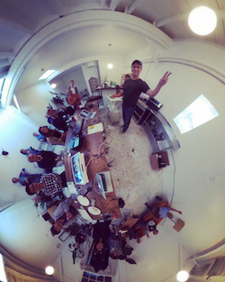
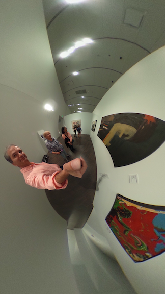
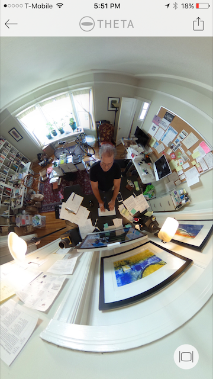

# About The Plug-in Community Guide

This document started as an internal document that Craig Oda wrote 
to help Jesse Casman with meetings at CES 2018 in Las Vegas.  Craig
and Jesse found 
out that Ricoh was planning to announce a radical, new strategy for 
360 cameras. In January of 2018, Ricoh announced plans to open 
up the internal Android operating system
to external developers.

We immediately saw the potential to change how people approached VR 
and AR.  

At CES, we gained access to unlocked THETA V cameras under the
closed beta program that Ricoh offered developers. As we worked
with the community on building applications, this document grew.

## Jesse

Hello from San Francisco! This is Jesse (jcasman@oppkey.com), I've been working on the theta360.guide since 2015. We build projects and tutorials, connect with developers like you, and try to have a good time while we're doing it. Part of that is building usable documentation like this THETA V Plugin Development Community Guide! The Guide is constantly being updated as we test more and learn more. If you notice something that could be fixed or added, we'd love to hear from you. It's a community effort! The RICOH THETA is an extremely cool platform for development, with potential in so many different industries. If you're doing something in 360, let us know, and maybe consider adding it here to help out others.

