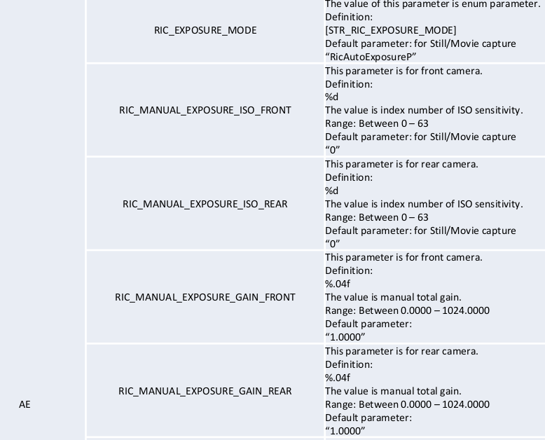
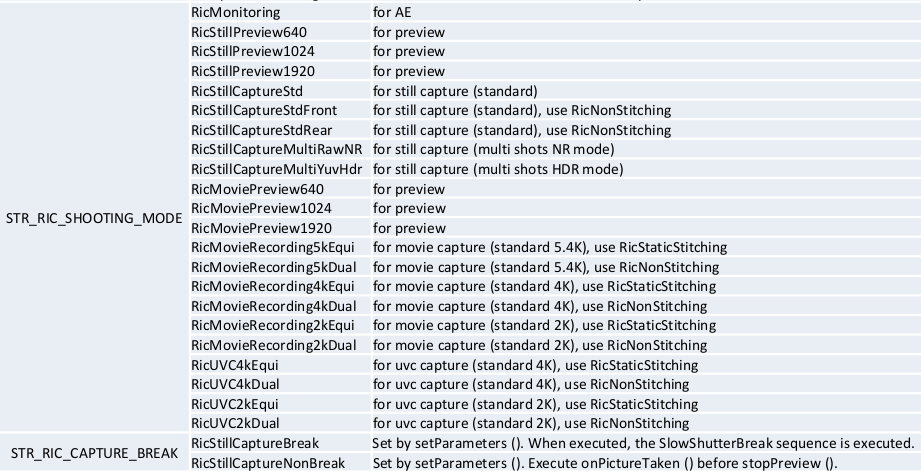

# RICOH THETA V Plug-in API

Please refer to the API reference manual.

NOTE: delete sections below.

## Dedicated Camera.Parameters (key)

Add these parameters in `Camera.Parameters`

## Dedicated Camera.Parameters (name)
Supported values for each parameter (name).

Use set method in `Camera.Parameters` class.
void set _(String key, String value)_

Simple Code snippet:

    Camera.Parameters parameters = camera.getParameters();
    parameters.set(“RIC_SHOOTING_MODE”, “ RicStillCaptureStd “);
    camera.setParameters(parameters); camera.startPreview();
    camera.takePicture();

Note: Use Camera API, not Camera2 API.
Details:

https://developer.android.com/reference/android/hardware/Camera.html

## Register as Plug-in App

    curl -X POST 192.168.1.1/osc/commands/execute --data
    '{"name":"camera._setApplication","parameters":{"packageName":"com.theta360.sa
    mple","boot":"true","force":"false"}}' -H 'content-type: application/json‘

## Notes

- Camera2 API does not work in THETA V
- Camera class in Android API can be used.
    - This class was deprecated in API level 21. But it works in THETA V.

## App Inside THETA V

- Press MODE button for 2sec
    - Boot specified plug-in app
- During Plugin mode
    - All controls are conducted by Plugin app.
        - No WebAPI, USB-API available
    - Rules for plugin
        - Light on LED2 as white
        - call “com.theta360.receptor” after pressing MODE button for 2sec.

## Debugging Tips

### Checking GUI

use Vysor chrome app to see desktop of THETA V

### Key Code

- Shutter button: 27
- Mode button: 130
- WLAN Key: 284

