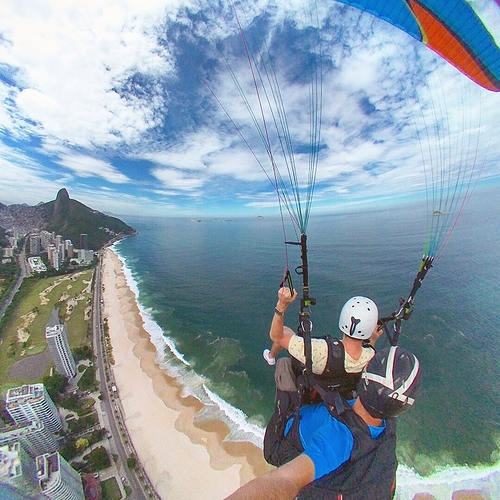
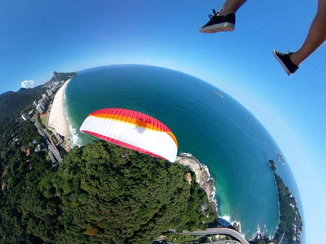
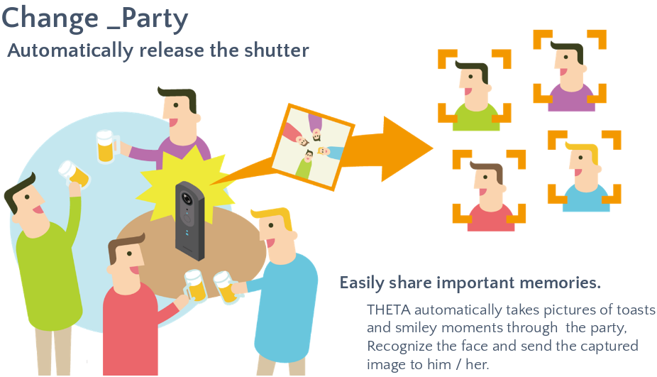
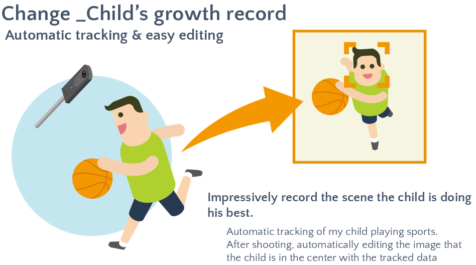
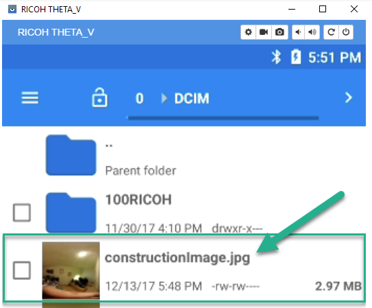
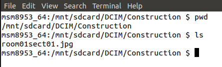

# Plugin Ideas

We are constantly working with community members to support "ideation," scoping out possible plug-ins and helping define concepts. Dealing with feature requests and turning those into workable code is a process. Brainstorming, coming up with concepts, sharing them, stress-testing them, doing this within in the community often moves a concept to code more quickly.

## Hands-Off Action Time-Lapse Concept

Thanks to [Daniel Towersey](https://community.theta360.guide/u/danieltowersey/summary) from the theta360.guide community for this concept for a "Hands-Off Action Time-Lapse" plug-in for the THETA V to be using in paragliding. 

> > Here at our paragliding site alone there must be about 30 to 50 Theta users awaiting such an update, or even better, a wireless remote shutter to substitute the ca-3 cable remote…

Full original discussion [here](https://community.theta360.guide/t/using-mesh-iot-button-with-ricoh-theta-to-create-remote-wireless-shutter/1641/20) covers lots of details.

### Description of Requirements from Daniel:

> > We use GoPro for standard photo and video included in our package, and sell 360º photos as an optional photo package.
I used an LG 360 cam with I st with the app for interval shooting with the app before take off, and then just needed to press the camera button in flight (on a monopod).
I changed my LG for the Theta V due to 4k video and much superior seaming of the images, but unfortunately found out that for interval shooting I need to press the button on the app, not the camera, with is a pain… other pilots use the wired ca-3 remote shutter with is also clumsy…
Can’t get my head around the fact that the Theta doesn’t have a wireless remote shutter, and the camera button will only take still images even though it is set for interval shooting through the control app…

### To build this plug-in, here's a possible Project Requirements

* Plug-in inside of camera handles timelapse
* Shutter button starts/stops timelapse
* White LED above shutter button indicates that it is in plug-in mode
* Magenta WiFi LED below shutter button flashing indicates that timelapse is activated
* Rate of flashing provides a clue as to current setting
* Button side button (mode) cycles through pre-set settings
* Companion mobile app is used to configure timelapse settings and store them into camera

Some more thoughts from Craig ([@codetricity](https://community.theta360.guide/u/codetricity/summary)) about hardware needed for this project [here](https://community.theta360.guide/t/using-mesh-iot-button-with-ricoh-theta-to-create-remote-wireless-shutter/1641/15).

Think you could build this? :-)

# More Concept Ideas from RICOH 

## Example Construction Concept

I created a new plugin called *ConstructionPlugin* to
reduce the time taken to take hundreds of images at construction sites.

The idea is to use a separate application to create a route of rooms.
The plugin then saves unique files names for each room.

As a first step, the plugin saves the construction images
with a file name prefaced by *construction*.

I then created a directory called `Construction` to store
all my construction pictures for business 
separately from the normal camera pictures stored in `100RICOH`.
I am using a more scalable naming convention of the form
 `room01sect01.jpg`.

In `MainFragment.java`, I changed the file save location.

    private Camera.PictureCallback mJpegPictureCallback = new Camera.PictureCallback() {
        @Override
        public void onPictureTaken(byte[] data, Camera camera) {
            mParameters.set("RIC_PROC_STITCHING", "RicStaticStitching");
            mCamera.setParameters(mParameters);
            mCamera.stopPreview();

            String fileUrl = "/storage/emulated/0/DCIM/Construction/room01sect01.jpg";
            try (FileOutputStream fileOutputStream = new FileOutputStream(fileUrl)) {
                fileOutputStream.write(data);
            } catch (IOException e) {
                e.printStackTrace();
            }

            mCamera.startPreview();
        }
    };

Using `adb shell`, I can log into the camera and make sure that it's saving the file in the correct filename format and directory. On the camera, you can access it in `/mnt/sdcard/DCIM/Construction/`

Back on my workstation, I can copy all the construction images from the camera to my workstation with:

    $ adb pull /sdcard/DCIM/Construction/

In this test, transferring 13 images took 1.9 seconds using a USB cable. 
The files total 42 MB. Each image has a resolution of 5376x2896.  
Once I have the image on my workstation, I can then open the image up in a file browser to
see it in equirectangular format.

My code snippet now looks like this:

    if (roomNumber > 9)
    {
        roomNumberStr = Integer.toString(roomNumber);
    } else {
        roomNumberStr = "0" + Integer.toString(roomNumber);

    }

    String fileUrl = "/storage/emulated/0/DCIM/Construction/room" + roomNumberStr + "sect01.jpg";
    try (FileOutputStream fileOutputStream = new FileOutputStream(fileUrl)) {
        fileOutputStream.write(data);
        roomNumber = roomNumber + 1;
