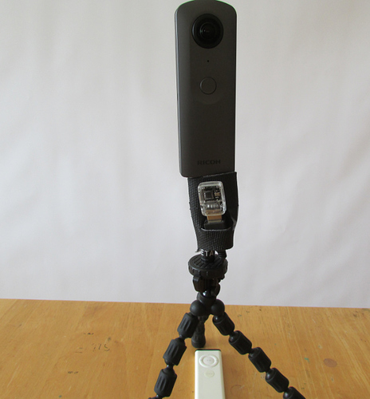

# Plugin Concepts from the Community

We are constantly working with community members to support "ideation," scoping out possible plug-ins and helping define concepts. Dealing with feature requests and turning those into workable code is a process. Brainstorming, coming up with concepts, sharing them, stress-testing them, and doing this within in the community can move a concept to real code and a finish, sellable product more quickly.

## Hands-Off Action Time-Lapse Concept

Thanks to [Daniel Towersey](https://community.theta360.guide/u/danieltowersey/summary) from the theta360.guide community for this concept for a "Hands-Off Action Time-Lapse" plug-in for the THETA V to be using in paragliding. 

### Description of Requirements from Daniel:

> > We use GoPro for standard photo and video included in our package, and sell 360º photos as an optional photo package.
I used an LG 360 cam with I st with the app for interval shooting with the app before take off, and then just needed to press the camera button in flight (on a monopod).
I changed my LG for the Theta V due to 4k video and much superior seaming of the images, but unfortunately found out that for interval shooting I need to press the button on the app, not the camera, with is a pain… other pilots use the wired ca-3 remote shutter with is also clumsy…
Can’t get my head around the fact that the Theta doesn’t have a wireless remote shutter, and the camera button will only take still images even though it is set for interval shooting through the control app…

And there are users waiting to get their hands on an app like this:

> > Here at our paragliding site alone there must be about 30 to 50 Theta users awaiting such an update, or even better, a wireless remote shutter to substitute the ca-3 cable remote…

### To build this plug-in, here's a possible Project Requirements

* Plug-in inside of camera handles timelapse
* Shutter button starts/stops timelapse
* White LED above shutter button indicates that it is in plug-in mode
* Magenta WiFi LED below shutter button flashing indicates that timelapse is activated
* Rate of flashing provides a clue as to current setting
* Button side button (mode) cycles through pre-set settings
* Companion mobile app is used to configure timelapse settings and store them into camera

Some more thoughts from Craig ([@codetricity](https://community.theta360.guide/u/codetricity/summary)) about 
possible alternatives to this project using hardware to trigger the timelapse with WiFi or Bluetooth are [here](https://community.theta360.guide/t/using-mesh-iot-button-with-ricoh-theta-to-create-remote-wireless-shutter/1641/15). 
Right now, it looks like the best way to approach the project with with software only and avoid the need to
manufacture or buy a wireless remote. Scroll up to get the full original discussion.

Think you could build this? :-)

## Example Construction Concept

I created a new plugin called *ConstructionPlugin* to
reduce the time taken to take hundreds of images at construction sites.

The idea is to use a separate application to create a route of rooms.
The plugin then saves unique files names for each room.

As a first step, the plugin saves the construction images
with a file name prefaced by *construction*.

I then created a directory called `Construction` to store
all my construction pictures for business 
separately from the normal camera pictures stored in `100RICOH`.
I am using a more scalable naming convention of the form
 `room01sect01.jpg`.

In `MainFragment.java`, I changed the file save location.

    private Camera.PictureCallback mJpegPictureCallback = new Camera.PictureCallback() {
        @Override
        public void onPictureTaken(byte[] data, Camera camera) {
            mParameters.set("RIC_PROC_STITCHING", "RicStaticStitching");
            mCamera.setParameters(mParameters);
            mCamera.stopPreview();

            String fileUrl = "/storage/emulated/0/DCIM/Construction/room01sect01.jpg";
            try (FileOutputStream fileOutputStream = new FileOutputStream(fileUrl)) {
                fileOutputStream.write(data);
            } catch (IOException e) {
                e.printStackTrace();
            }

            mCamera.startPreview();
        }
    };

Using `adb shell`, I can log into the camera and make sure that it's saving the file in the correct filename format and directory. On the camera, you can access it in `/mnt/sdcard/DCIM/Construction/`

Back on my workstation, I can copy all the construction images from the camera to my workstation with:

    $ adb pull /sdcard/DCIM/Construction/

In this test, transferring 13 images took 1.9 seconds using a USB cable. 
The files total 42 MB. Each image has a resolution of 5376x2896.  
Once I have the image on my workstation, I can then open the image up in a file browser to
see it in equirectangular format.

My code snippet now looks like this:

    if (roomNumber > 9)
    {
        roomNumberStr = Integer.toString(roomNumber);
    } else {
        roomNumberStr = "0" + Integer.toString(roomNumber);

    }

    String fileUrl = "/storage/emulated/0/DCIM/Construction/room" + roomNumberStr + "sect01.jpg";
    try (FileOutputStream fileOutputStream = new FileOutputStream(fileUrl)) {
        fileOutputStream.write(data);
        roomNumber = roomNumber + 1;

## IR Controller Concept

This is a concept to control timelapse from a paraglider or other 360 action situation.

### Components
* FLIRC IR receiver $22
* USB OTG adapter (maybe $7 on eBay if user does not already have one?)
* Existing IR remote you have around the house
* 1/4" by 20 tpi stud and nut to attach to bracket on paraglider

### Assembly

### Prototype Case
This is a prototype neoprene case that holds the components against the stud. Case objectives:

* prevent IR receiver from moving in the wind or through action sport movement
* secure components to solid base to prevent accidental detachment and loss while in-flight
* easy removal from camera with velcro tabs

### Mounting
The accessory can be mounted on any standard 1/4" tripod mount or bracket.

Mounting the base of the accessory to the bracket will attach both the camera and IR receiver with a solid metal bolt.

### Configuring IR Controller
The FLIRC desktop software is used one-time to map the buttons on the IR controller to Android keycodes. The mapping is saved to FLIRC and is retained when power is off.

### Configuring Camera
As the camera only has basic LEDs to display output, I suggest saving settings ahead of time into the camera with a mobile phone. With the mobile phone or desktop computer, the user can save three different timelapse configurations to the camera prior to the shoot.

### Example Operation
Assuming we keep the operation simple and use only two buttons on the IR controller:

### Use
* press play once to start timelapse
  * flash WiFi LED in magenta to indicate operation. Rate of blinking indicates delay
* press play again to stop timelapse
  * turn off LED
  
### On-site configuration
* press right arrow to move from default timelapse to longer delay
  * LED blink rate indicates current delay
* press right arrow again to move to next preset delay, making the delay longer
* press right arrow again to cycle back to default timelapse delay

### Code (Not Implemented)
This is only a concept. I have not attempted to build the plug-in.

### IR Remote Button Press
The first step is to modify the 'KEYCODE_CAMERA' below to a key from Android using this reference:
https://developer.android.com/reference/android/view/KeyEvent

For example, changing it to 'KEYCODE_T' and checking to see if it can take the keyCode from the IR. I’d like to first plug a normal USB computer keyboard into the THETA with USB OTG and see if I can trigger the shutter by pressing T. Then, I can try the remote.

    public void onKeyDown(int keyCode, KeyEvent event) {
                if (keyCode == KeyReceiver.KEYCODE_CAMERA) {
                    customShutter(m_is_bracket);
                    if(m_is_bracket){
                        notificationLedBlink(LedTarget.LED3, LedColor.MAGENTA, 300);

### Taking Picture
We can use the standard RICOH SDK code to take the picture. We just need to set up a variable delay between pictures.

    intent = new Intent("com.theta360.plugin.ACTION_AUDIO_SHUTTER");
    sendBroadcast(intent);
    mCamera.takePicture(null,null, null, pictureListener);
    
### LED Indicator
We can use the standard RICOH code to control the feedback from the LED.

    notificationLedBlink(LedTarget.LED3, LedColor.MAGENTA, 300);

# Plug-in Concepts from RICOH 

