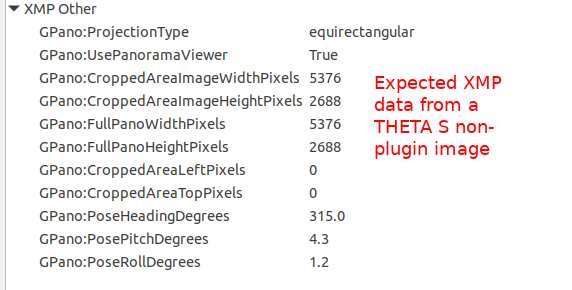

# Custom Development

## Overview

Your primary way to control the camera is with the Android Camera class. Although this API was
deprecated in level 21, it still works. Make sure you use the older Camera class and not
the newer camera2 API.

Use the offiical Android API documentation as your main reference.

[https://developer.android.com/reference/android/hardware/Camera.html](https://developer.android.com/reference/android/hardware/Camera.html)

There are a set of THETA features that are not covered by the Android 
[Camera](https://developer.android.com/reference/android/hardware/Camera.html)
API. These are covered by using 
[Camera.Parameters](https://developer.android.com/reference/android/hardware/Camera.Parameters.html)

Example:

    mParameters.set("RIC_PROC_STITCHING", "RicStaticStitching");
    mCamera.setParameters(mParameters);

Here's example of setting multiple parameters and then taking a picture.

        public void takePicture() {
            mParameters.setPictureSize(5376, 2688);
            mParameters.set("RIC_SHOOTING_MODE", "RicStillCaptureStd");
            mParameters.set("RIC_EXPOSURE_MODE", "RicAutoExposureP");
            mParameters.set("recording-hint", "false");
            mParameters.setJpegThumbnailSize(320, 160);
            mCamera.setParameters(mParameters);
            mCamera.takePicture(null, null, mJpegPictureCallback);
        }

The plug-in SDK is a great place to get started. The SDK can be downloaded from the theta360.com site. If
you have any problems finding the download location,
please send an email to jcasman@oppkey.com for
 friendly (I hope) help.  :-)

## Using the WiFi Web API 

Your plug-in can also use the 
[RICOH THETA API v2.1](https://developers.theta360.com/en/docs/v2.1/api_reference/) web API. Send POST commands 
to the camera's Web API at (http://localhost:8080/). When using the Web API from the plug-in, digest authentication is not required regardless of the wireless LAN mode. For detailed specifications of the Web API, please refer to [API Reference - v2.1 - API & SDK \| RICOH THETA Developers](https://developers.theta360.com/en/docs/v2.1/api_reference/)

The Web API can not be used when the plug-in controls the camera device using the Camera API.

## Configuration of Plug-in With Web Server

The plug-in can launch a web server that provides a WebUI or its own API. By using port 8888 on the plug-in web server, it is possible to open a web page provided by the plug-in web server. You can then
build a basic app on a smartphone to access the 
plug-in web server on the THETA V.

Your app can look for the presence or absence of the web server by using the Web API's [camera._listPlugins](https://developers.theta360.com/en/docs/v2.1/api_reference/commands/camera._list_plugins.html). The information from camera._listPlugins consists of information described in the configuration file (\assets\settings.json) of each plug-in. If the setting file does not exist or the setting value is incorrect, the default value is written in the camera._listPlugins information. 

Sample configuration file:

~~~
{
 "webServer": true
}
~~~

## Camera Hardware

- APQ8053 ([Snapdragon 625](https://www.qualcomm.com/products/snapdragon/processors/625))
    - CPU: Cortex A-53 x8
    - GPU: Qualcomm AdrenoTM 506
- 3GB LPDDR3 SDRAM, 32GB eMMC
- WLAN/BT (2 models)
    - 2.4GHz (1-11ch) only
    - 2.4GHz(1-11ch) + 5GHz(W52)
- 12MP CMOS x2, 4ch MEMS microphones, 1ch speaker

## Internal Storage 
The THETA V has a maximum storage size of 32GB. Developers can use 19GB  for storage of their plug-in applications and approximately 1.5GB for the plug-in itself. The partition for data is `/data`.

The sample code stores data to `DCIM`.

This is an example of saving all your images to a sub-directory `Construction` and then
adding a number to the file name. There's a separate bit of code to iterate the roomNumber.

    String fileUrl = "/storage/emulated/0/DCIM/Construction/room" + roomNumberStr + "sect01.jpg";

## Debugging

You can debug the THETA V with a USB cable and adb.
The camera will operate in Plugin Mode while connected to adb.

You will be able to get debug messages similar to the example below:

       12-14 07:53:24.105  1171  1373 E TaskPersister: File error accessing recents directory (directory doesn't exist?).

Example debug output with the camera connected to my Linux computer with a USB cable 
and in plug-in mode.

## Set Active Plugin

To set the active plugin, you can also use the WiFi API. To use 
the WiFi API, you must connect your 
computer to the THETA with WiFi. 
Although you can use a curl script to switch plugins with the WiFi API,
I find it easier to use a tool like 
Restlet Client to save my HTTP test scripts into a group. I can select an
individual test and run it with a push of a button. To switch plugins, I 
saved a script for  `camera._setPlugin`. You can geta list of plugins with 
`camera._listPlugins`.

In addition to saving the HTTP test scripts, Restlet Client or Postman will show the
JSON response in *pretty* format automatically. With curl, you will need to
pipe the output to another tool to get *pretty print*.

## Finishing a Plug-in

Push and hold the Mode Button for 2 seconds to finish. When the plug-in detects that the Mode Button has been pressed for 2 seconds, it must quit. When the plug-in finishes, a [notification of termination for the plug-in](/docs/theta-plugin-ref/broadcast-intent/#notifying-completion-of-plug-in) must be made.

## Camera LEDs

Example below shows camera turning on all LEDs.

    Intent ledon = new Intent("com.theta360.devicelibrary.receiver.ACTION_ADJ_LED");
    ledon.putExtra("ledNo", 0);
    ledon.putExtra("color", "on");
    sendBroadcast(ledon);

In the example below, I tested turning on all the LEDs when a picture is 
taken by pressing the shutter button.

    public boolean onKeyDown(int keyCode, KeyEvent event) {
        if (keyCode == KEYCODE_CAMERA) {
            takePicture();
            // “ledNo” can be set LED number (0-8). 0 means all LEDs.
            ledon.putExtra("ledNo", 0);
            // color can be "on", "red", "green", "blue"
            ledon.putExtra("color", "on");
            sendBroadcast(ledon);
        }

Snippet below will turn all LEDs off.

    Intent ledoff = new Intent("com.theta360.devicelibrary.receiver.ACTION_ADJ_LED_OFF");
    ledoff.putExtra("ledNo", 0);
    sendBroadcast(ledoff);

## Camera Buttons

There are three buttons you can map:

| Button | Code | Location |
| ------ |:----:| -------- |
| WiFi   | 284  | side middle |
| Mode   | 130  | side bottom |
| Shutter| 27   | front       |

In the sample code, `MainActivity.java` has this at the top 

    public static final int KEYCODE_CAMERA = 27;
    public static final int KEYCODE_MEDIA_RECORD = 130;

Further down in that same file, you'll see the trigger.

    public boolean onKeyDown(int keyCode, KeyEvent event) {
        if (keyCode == KEYCODE_CAMERA) {
            takePicture();
        }

        return super.onKeyDown(keyCode, event);
    }

## Broadcast Examples

__Broadcast to sound error tone__
   
    com.theta360.devicelibrary.receiver.ACTION_AUDIO_WARNING

__Broadcast to launch shooting application after plugin finish__

    com.theta360.devicelibrary.receiver.ACTION_BOOT_BASIC

### Storage in eMMC

`/sdcard/DCIM/` can be used.

### Troubleshooting

- Force power down
    - Press WLAN + POWER buttons for 10 seconds
- WLAN reset
     - Press WLAN button for 10 seconds

## Problems
At the time of writing this unofficial guide, the plug-in development 
environment is in closed beta. Problems listed here may be fixed by the 
time you read this.

### XMP Data
1/26/2018:
In my tests, the image did not have XMP data in it, so I'll need to add it 
in the future. There's also an uncomfirmed rumor that Ricoh is working
on a library to help with this.

### Dual-Fish Still Image

I attempted to save still images as dual-fisheye using this parameter.

    mParameters.set("RIC_PROC_STITCHING_TYPE", "RicNonStitching");

In my tests, the image was squished.

The actual size of the dual-fish image is 5792x2896. However, I 
could not get the command below to work.

    mParameters.setPictureSize(5792, 2896);

The image above is sized at 5376x2688. I suspect the smaller size is the 
reason for the distortion.