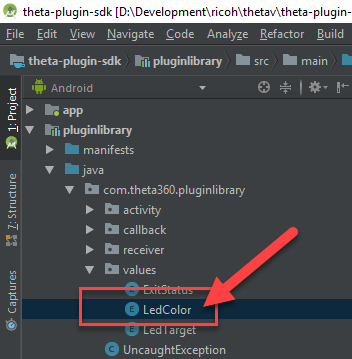
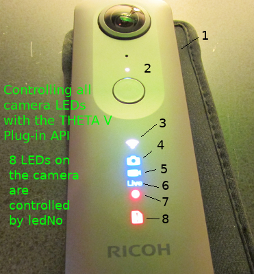
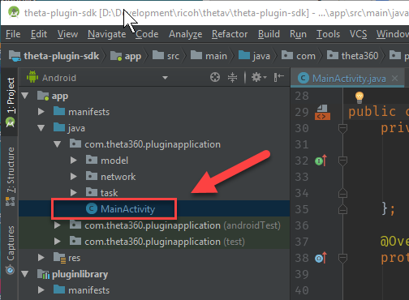
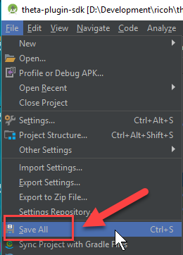
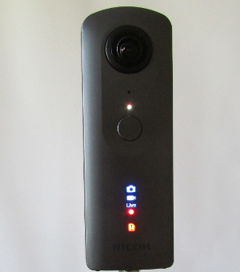

# Custom Development Tutorial

## Overview

Your primary way to control the camera is with the Android Camera class. Although this API was
deprecated in level 21, it still works. Make sure you use the older Camera class and not
the newer camera2 API.

Use the offiical Android API documentation as your main reference.

[https://developer.android.com/reference/android/hardware/Camera.html](https://developer.android.com/reference/android/hardware/Camera.html)

There are a set of THETA features that are not covered by the Android 
[Camera](https://developer.android.com/reference/android/hardware/Camera.html)
API. These are covered by using 
[Camera.Parameters](https://developer.android.com/reference/android/hardware/Camera.Parameters.html)

## 1 Control Camera LEDs

### 1.1 First steps with pluginlibrary

Open Android Studio. Identify the available colors. In `pluginlibrary`, the LED colors are defined in `LedColor`. Open
the file to inspect the available colors.

    pluginlibrary -> java -> com.theta360pluginlibrary -> values -> LedColor

### 1.2 Identify LED Colors

You'll only be able to change the color for the WiFi LED on the front of the camera.  Take a note of the color
you want to use. The next steps in this tutorial will use MAGENTA.

    RED("red", 0b001),
    GREEN("green", 0b010),
    BLUE("blue", 0b100),
    CYAN("cyan", 0b110),
    MAGENTA("magenta", 0b101),
    YELLOW("yellow", 0b011),
    WHITE("white", 0b111),;

### 1.3 Identify Camera LED Targets

The camera has 8 LEDs. You can control LEDs 3 through 8.
This tutorial will focus on LED3, the WiFi LED. You can try different LEDs
on your own. 

### 1.4 Review LED Example in SDK.

In `MainActivity`, there is an example that blinks the WiFi LED.

    app -> java -> com.theta360.pluginapplication -> MainActivity

Look for this code section.

    public void onKeyUp(int keyCode, KeyEvent event) {
        /**
            * You can control the LED of the camera.
            * It is possible to change the way of lighting, the cycle of blinking, the color of light emission.
            * Light emitting color can be changed only LED3.
            */
        notificationLedBlink(LedTarget.LED3, LedColor.BLUE, 1000);

You can change the target, color, and blink rate. The higher the number, the slower the rate.
The example below will use a delay of 300 between blinks to cause the LED to blink faster.

### 1.5 Change LED color and blink rate

The example below will flash LED3, the WiFi LED, faster and display
a magenta color.  Edit `MainActivity` as follows.

        notificationLedBlink(LedTarget.LED3, LedColor.MAGENTA, 300);

### 1.6 Save changes

Select *Save all* from the *File* menu. 

### 1.7 Build apk 

#### Changing LED Target

The example below shows how to blink LEDs 4, 5, 6, 7, and 8. Note that the
color is ignored.

    notificationLedBlink(LedTarget.LED4, LedColor.BLUE, 300);
    notificationLedBlink(LedTarget.LED5, LedColor.BLUE, 300);

    notificationLedBlink(LedTarget.LED6, LedColor.BLUE, 300);
    notificationLedBlink(LedTarget.LED7, LedColor.RED, 300);
    notificationLedBlink(LedTarget.LED8, LedColor.RED, 300);

## Camera Buttons

There are three buttons you can map:

| Button Common Name | Name in Library | Code | Location |
| ------------------ | ------------------- |:----:| -------- |
| WiFi               | KEYCODE_WLAN_ON_OFF | 284  | side middle |
| Mode               | KEYCODE_MEDIA_RECORD | 130  | side bottom |
| Shutter            | KEYCODE_CAMERA | 27   | front       |

In the pluginlibrary for the SDK, the `KeyReceiver` file has these values:

    public class KeyReceiver extends BroadcastReceiver {
        public static final int KEYCODE_CAMERA = 27;
        public static final int KEYCODE_MEDIA_RECORD = 130;
        public static final int KEYCODE_WLAN_ON_OFF = 284;

        public static final String ACTION_KEY_DOWN = "com.theta360.plugin.ACTION_KEY_DOWN";
        public static final String ACTION_KEY_UP = "com.theta360.plugin.ACTION_KEY_UP";
        private static final String KEY_CODE = "keyCode";
        private static final String KEY_EVENT = "KeyEvent";

In `MainActivity.java`, there is an example of using the `keyCode`.

    protected void onCreate(Bundle savedInstanceState) {
        super.onCreate(savedInstanceState);
        setContentView(R.layout.activity_main);

        // Set a callback when a button operation event is acquired.
        setKeyCallback(new KeyCallback() {
            @Override
            public void onKeyDown(int keyCode, KeyEvent event) {
                if (keyCode == KeyReceiver.KEYCODE_CAMERA) {
                    /*
                     * To take a static picture, use the takePicture method.
                     * You can receive a fileUrl of the static picture in the callback.
                     */
                    new TakePictureTask(mTakePictureTaskCallback).execute();
                }
            }

