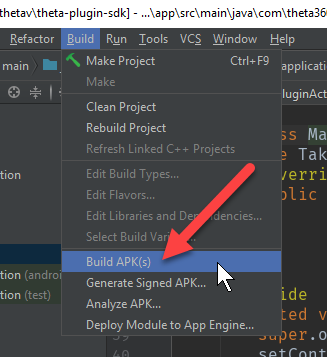
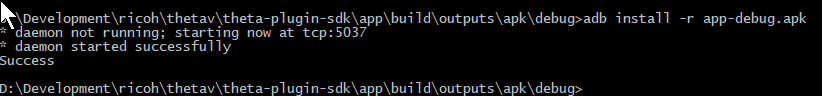
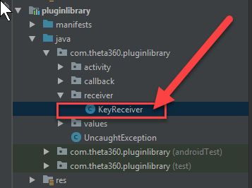

# Custom Development Tutorial

## Overview

Your primary way to control the camera is with the Android Camera class. Although this API was
deprecated in level 21, it still works. Make sure you use the older Camera class and not
the newer camera2 API.

Use the offiical Android API documentation as your main reference.

[https://developer.android.com/reference/android/hardware/Camera.html](https://developer.android.com/reference/android/hardware/Camera.html)

There are a set of THETA features that are not covered by the Android 
[Camera](https://developer.android.com/reference/android/hardware/Camera.html)
API. These are covered by using 
[Camera.Parameters](https://developer.android.com/reference/android/hardware/Camera.Parameters.html)

## 1 Control Camera LEDs

### 1.1 First steps with pluginlibrary

Open Android Studio. Identify the available colors. In `pluginlibrary`, the LED colors are defined in `LedColor`. Open
the file to inspect the available colors.

    pluginlibrary -> java -> com.theta360pluginlibrary -> values -> LedColor

### 1.2 Identify LED Colors

You'll only be able to change the color for the WiFi LED on the front of the camera.  Take note of the color
you want to use. This tutorial will use MAGENTA.

    RED("red", 0b001),
    GREEN("green", 0b010),
    BLUE("blue", 0b100),
    CYAN("cyan", 0b110),
    MAGENTA("magenta", 0b101),
    YELLOW("yellow", 0b011),
    WHITE("white", 0b111),;

### 1.3 Identify Camera LED Targets

The camera has 8 LEDs. You can control LEDs 3 through 8.
This tutorial will focus on LED3, the WiFi LED. You can try different LEDs
on your own. 

### 1.4 Review LED Example in SDK.

In `MainActivity`, there is an example that blinks the WiFi LED.

    app -> java -> com.theta360.pluginapplication -> MainActivity

Look for this code section.

    public void onKeyUp(int keyCode, KeyEvent event) {
        /**
            * You can control the LED of the camera.
            * It is possible to change the way of lighting, the cycle of blinking, the color of light emission.
            * Light emitting color can be changed only LED3.
            */
        notificationLedBlink(LedTarget.LED3, LedColor.BLUE, 1000);

You can change the target, color, and blink rate. The higher the number, the slower the rate.
The example below will use a delay of 300 between blinks to cause the LED to blink faster.

### 1.5 Change LED color and blink rate

The example below will flash LED3, the WiFi LED, faster and display
a magenta color.  Edit `MainActivity` as follows.

        notificationLedBlink(LedTarget.LED3, LedColor.MAGENTA, 300);

### 1.6 Save changes

Select *Save all* from the *File* menu. 

### 1.7 Build apk 

### 1.8 Identify location of apk

    theta-plugin-sdk > app > build > outputs > apk > debug > app-debug.apk

### 1.9 Check installation setup

We will use adb to install the apk into your THETA V. Confirm that you have the following set up:

* Your THETA V should be connected to your computer with a USB cable.
* You must be using an unlocked THETA V that is in *Developer Mode*
* adb needs to be in your PATH

If you are unsure about any of the steps above, refer to the previous sections. You can
also ask questions in the community at [http://plugin.community.theta360.guide](http://plugin.community.theta360.guide).
If you are at a workshop, please raise your hand and someone will assist you.

### 1.10 cd into apk directory

Change directory into the same directory that your apk is in.

### 1.11 Use adb to install the apk into your camera

In the directory that your apk is in, run the following command:

    adb install -r app-debug.apk

You should see  *Success*. If your daemon is not running, you will see message that it is starting.

### 1.12 Reboot camera

Hold the camera power button down for 4 seconds to shutdown the camera. You will see red LEDs flash.
If you do not hold the power button down for 4 seconds, the camera will go into sleep mode. Once the 
camera is shutdown, turn on the camera again by pressing the power button.

### 1.13 Put camera into plug-in mode

Press the mode button for longer than 2 seconds. LED2 will turn white.

### 1.14 Verify LED is blinking

After placing the camera into plug-in mode, you should see LED3 blinking with a magenta color.

Congratulations!  You've just successfully built and installed your first custom plug-in. You are now
a plug-in developer!

### 1.15 Troubleshooting

#### Problem: `adb install -r app-debug.apk` hangs

Unplug the USB cable from your computer and try again.

#### Problem: Install succeeds, but nothing happens

* Use the RICOH mobile app or the API to verify that plugin application is selected as the active plugin
* Use Vysor to uninstall old plug-in
* Use Vysor to start the plug-in. Click on the plug-in icon in Vysor with the same process you would use to launch
a mobile phone app

## 2 Control LED Target

In the the next example, we will blink LEDs 4, 5, 6, 7, and 8. We will not be 
controlling the color as only the color for LED3 can be controlled. 

### 2.1 Edit MainActivity in Android Studio

Go back to `MainActivity`. Comment out the line for LED3 and add the following lines to test the other 
LEDs.

    notificationLedBlink(LedTarget.LED4, LedColor.BLUE, 300);
    notificationLedBlink(LedTarget.LED5, LedColor.BLUE, 300);

    notificationLedBlink(LedTarget.LED6, LedColor.BLUE, 300);
    notificationLedBlink(LedTarget.LED7, LedColor.RED, 300);
    notificationLedBlink(LedTarget.LED8, LedColor.RED, 300);

### 2.2 Build, Install, Reboot

Follow the same process described in the section above.

1. Build the apk from within Android Studio
2. Find the location of the APK
3. cd into that directory
4. install the apk with `adb install -r app-debug.apk`
5. reboot camera

### 2.3 Test

Press the lower mode button for longer than 2 seconds to put the camera into 
plug-in mode. 

You should see all LEDs 4-8 blinking with a delay of 300ms between blinks.
    

Congratulations!  You've just finished your second custom plug-in for the RICOH 
THETA V.

## 3 Control Camera Buttons

In the next example, we'll control the buttons of the camera.

### 3.1 Inspect pluginlibrary

From inside of Android Studio, go back to pluginlibrary. It is part of the SDK.
Look for the `KeyReceiver` file.

In the KeyReceiver subclass of BroadcastReceiver, you can see that the three usable 
buttons are defined as constants.

    public class KeyReceiver extends BroadcastReceiver {
        public static final int KEYCODE_CAMERA = 27;
        public static final int KEYCODE_MEDIA_RECORD = 130;
        public static final int KEYCODE_WLAN_ON_OFF = 284;

        public static final String ACTION_KEY_DOWN = "com.theta360.plugin.ACTION_KEY_DOWN";
        public static final String ACTION_KEY_UP = "com.theta360.plugin.ACTION_KEY_UP";
        private static final String KEY_CODE = "keyCode";
        private static final String KEY_EVENT = "KeyEvent";

### 3.2 Locate buttons on camera

There are three buttons you can map:

| Button Common Name | Name in Library | Code | Location |
| ------------------ | ------------------- |:----:| -------- |
| WiFi               | KEYCODE_WLAN_ON_OFF | 284  | side middle |
| Mode               | KEYCODE_MEDIA_RECORD | 130  | side bottom |
| Shutter            | KEYCODE_CAMERA | 27   | front       |

Two of the buttons are on the side of the camera, below the power button. The third
button is on the front of the camera. It is the big *shutter* button.

### 3.3 Open `MainActivity`

In Android Studio, go back to `MainActivity` and look for the `onKeyDown` method.

In `MainActivity.java`, there is an example of using the `keyCode`.

    protected void onCreate(Bundle savedInstanceState) {
        super.onCreate(savedInstanceState);
        setContentView(R.layout.activity_main);

        // Set a callback when a button operation event is acquired.
        setKeyCallback(new KeyCallback() {
            @Override
            public void onKeyDown(int keyCode, KeyEvent event) {
                if (keyCode == KeyReceiver.KEYCODE_CAMERA) {
                    /*
                     * To take a static picture, use the takePicture method.
                     * You can receive a fileUrl of the static picture in the callback.
                     */
                    new TakePictureTask(mTakePictureTaskCallback).execute();
                }
            }

### 3.4 Map takePicture to Middle Side Button

As a simple test, we will map the middle side or *wifi* button to take a picture. 
If you forget the constant name, you can use Android Studio code completion to find it.

### 3.5 Build, install, test

Follow these steps:

1. build the apk from inside of Android Studio
2. install it with adb
3. reboot camera
4. put camera into plug-in mode
5. test it on the camera by pressing the middle button on the side of the camera

### 3.6 Celebration and next steps

Congratulations! You've successfully built three plug-ins. You can now go
back to the main Android developer documentation on the Android site to 
add in standard Android functionality. You can also  test different libraries 
for network and image processing.  The next section of this guide, 
[Custom Development Tips](/customtips),
will show you how to adjust the stitching of the THETA images. We'll update this
document regularly.  If you have questions, the 
[community](https://community.theta360.guide/c/theta-api-usage/plugin) is here to help.