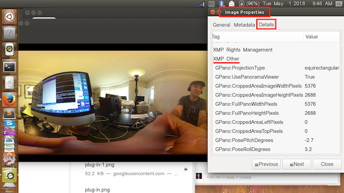

# Custom Development Tips
There is extensive documentation on the 
[RICOH Developer Connection THETA Plug-in portal](https://api.ricoh/docs/theta-plugin/sdk/)

The plug-in SDK is a great place to get started. The SDK can be downloaded from [GitHub](https://github.com/ricohapi/theta-plugin-sdk). If
you have any problems 
please send an email to jcasman@oppkey.com for
 friendly (I hope) help.  :-)

## Internal Storage 
The THETA V has a maximum storage size of 32GB. Developers can use 19GB  for storage of their plug-in applications and approximately 1.5GB for the plug-in itself. The partition for data is `/data`.

`/sdcard/DCIM/` can be used.

This is an example of saving all your images to a sub-directory `Construction` and then
adding a number to the file name. There's a separate bit of code to iterate the roomNumber.

    String fileUrl = "/storage/emulated/0/DCIM/Construction/room" + roomNumberStr + "sect01.jpg";

## Dual-Fish Still Image Example

If you want to save still images as dual-fisheye, use this parameter:

    mParameters.set("RIC_PROC_STITCHING_TYPE", "RicNonStitching");

The size of the dual-fish image is 5792x2896. Use the command below:

    mParameters.setPictureSize(5792, 2896);

[This article](https://community.theta360.guide/t/dual-fisheye-images-with-theta-v-plug-in/2692/8?u=codetricity) 
provides more information on a plug-in built by community
developer Ichi Hirota.

The picture below is from Ichi Hirota.

Here's example code from Ichi Hirota for bracketing.

## Text to Speech Status
As of May 21, 2018, `android.speech.tts` does not work. This may
start working in a future update. For now, you can try other Text-Speech engines
for Android. A list of untested engines is [here](http://hyperionics.com/TtsSetup/eng/TtsInfo.html). Another untested possibility
could be the [Flite TTS Engine for Android](https://github.com/happyalu/Flite-TTS-Engine-for-Android).

Currently, human speech can be played directly from the internal speaker of 
the THETA V. However, the volume is low. We are trying to figure out how
to increase the volume.

Here's a [test of the THETA V playing "I Have a Dream"](https://youtu.be/AeebH7ONTkg) by Dr. Martin Luther King Jr.

## XMP Data
[UPDATED May 1, 2018] Images produced by the Plugin Application have XMP data in them. These screenshots are just looking at image properties using the GNOME Image Viewer app on an Ubuntu laptop. 

Here is an image taken with the Plugin Application, showing ProjectionType and more:

In comparison, here is an normal image taken at my desk, using the RICOH THETA V as a camera, not in Plug-in Mode. 

However, I have access to an example of a dual fish-eye image taken with a plug-in built by a developer that does not include XMP data. This may indicate that as you develop your plug-in, you may need to inject XMP data. There's an uncomfirmed rumor that Ricoh is working
on a library to help with this.

Here's the example:

