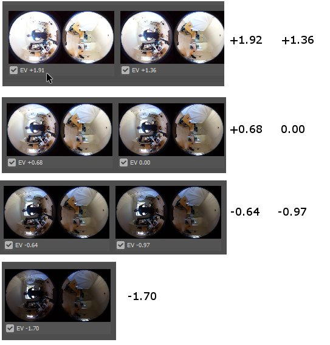
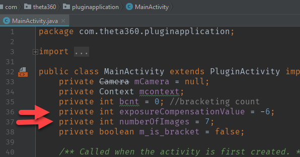
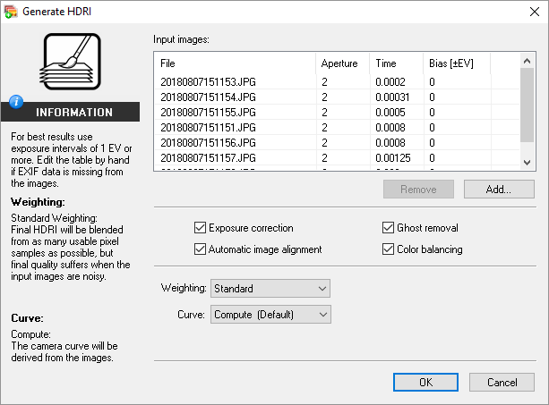

# Dual-Fisheye Still Image

By using plug-in technology, you can improve the user experience for your customers. One example is to
reduce the time between still image shots. The RICOH THETA S requires approximately 8 seconds between
shots. The RICOH THETA V reduced this time to 4 seconds. The dual-fisheye plug-in reduces
the time between shots to less than a second. 

The reduction in time is achieved by delaying the process of converting dual-fisheye images into a single equirectangular image inside the camera.

This is useful for the following applications:

1. HDR - High Definition Range - photography technique for greater luminosity
2. Timelapse
3. High volume pictures such as taking 1,000 images at a large construction site
4. Factory or workflow optimization (Taking pictures of an assembly line or other process involving people moving items)
5. Computer graphics 3D model scenes to get lighting information

## Concepts Covered

- Image stitching control
- Permission setting to access storage and camera
- Post-production workflow
- Conversion of dual-fisheye to equirectangular
- High Dynamic Range Images

## Install apk from Source

### Requirements

* Tested with THETA V firmware 2.40.2

### Known Issues

This is a simplified plug-in example with limited error checking. This example is sensitive
to the duration of button presses.

* If you press the plug-in mode button for too long or too short, the plug-in may crash
* If you press the Wi-Fi button for too long to change from single to multi-shot mode, the application may crash
* If you press the shutter button for too long when you take the picture or pictures, the application may crash

### Download GitHub Repository

Clone or download the [GitHub repository for this tutorial](https://github.com/codetricity/original-dual-fisheye-plugin).

Repository Organization

    /apk/app-debug.apk - binary to install in the RICOH THETA V
    /tools/stitcher/MiSphereConverter_for_THETAV.apk - mobile stitching application for your Android phone
    /app/src/main/java/com/theta360/pluginapplication/MainActivity.java - main plug-in source code

> TIP: If you want to use the plug-in first and do not want to download the source, an 
> updated apk was released on August 6, 2018. You can [download the apk](https://drive.google.com/file/d/1DCHBuMGQUsn5ZTolp6YObuiCIsmiZJAX/view?usp=sharing) 
> only. This version is not the same as the apk in the GitHub
> repository.

### Open Android Project

*File -> Open*

### Build apk

*Build -> Build APK(s)*

> NOTE: If the build fails, you can continue with the tutorial using the
> binary apk provided

### Locate apk

### Use adb to install apk

Connect your THETA V to your workstation with a USB cable. 

cd into the directory that your apk is in.

    adb install -r app-debug.apk

> NOTE: If you've previously installed the THETA Plug-in SDK apk, you must
> first uninstall the SDK plug-in from the THETA. If adb does not detect your
> camera, unplug the camera and plug it back in.  If the camera is still not
> detected, verify that your camera is unlocked. You must join the partner
> program to unlock your camera.

### Use Vysor to set apk permissions

#### Start Vysor

#### Select Apps in Settings

Scroll down until you see apps.

#### Select *Plugin Application*

#### In App Info select Permissions

#### Enable Camera and Storage

### Reboot Camera and Put Into Plug-in Mode

- Unplug camera
- Hold power button for 8 seconds
- Turn camera back on
- Hold Mode button for 2 seconds or longer
- Confirm that that the LED above the shutter button is white
- Wi-Fi LED below shutter will be aqua color and flashing

### Taking Pictures

The camera has two modes by default. It can either take a single dual-fisheye image or 
take three dual-fisheye pictures in rapid succession for bracketing.  You can switch
between single image and bracketing mode by pressing the Wi-Fi button on the side of the camera.
This must be a short press of less than 2 seconds.

#### Single Image

In single image mode. the Wi-Fi LED will be aqua and flashing.

#### 3 Shot Mode

Press the Wi-Fi button on the side of the camera to get
the camera into 3 shot mode.

**WARNING: If you press the Wi-Fi button for more than a second, the plug-in may not work properly. Press the Wi-Fi button on the side of the camera firmly and release 
it quickly.**

In 3 shot mode, the Wi-Fi LED will be magenta and flashing faster compared
 to when the camera is in still image mode. 

The gif below was contributed by community member @juantonto.

For 3 shot mode, you need to stabilize the camera for the duration of 
the three shots. Place the camera on tripod or stand it up on a table.

Press the shutter button. This must be a short press of less than 2 seconds.

Refer to the video above for the expected behavior of the camera,
including LED and audio feedback.

### Confirm pictures were taken

Connect camera to your computer with a USB cable.

In a file browser such as File Explorer, click into RICOH THETA V in
the same process you use for a normal camera or storage device.
Go into `DCIM/100RICOH`. You will see the dual-fisheye images with
filenames that contain a date and time stamp.

## Stitching Dual-fisheye Images Into Equirectangular

For most applications, you will need to stitch the images in post-production processing
using your own stitching library. For this tutorial, we will use a few 
commercial products to stitch the dual-fisheye image into equirectangular. 
Third-party stitching libraries do not have the lens parameter information
from Ricoh and thus require manual callibration for each camera. Ricoh does
not make the lens parameter information available.

### Android Phone Stitching Application

Ichi Hirota has produced a stitching library and Android mobile phone app that requires a one-time callibration for each camera. A trial version of the mobile app apk is available in the GitHub repository you downloaded for this tutorial. It is under the directory [tools/stitcher](https://github.com/codetricity/original-dual-fisheye-plugin/tree/master/tools/stitcher). This trial version of the app has a watermark.

You can commercially license Ichi's stitching library 
and Android application.
For more information on licensing Ichi's stitching library and Android application,
please contact Jesse Casman at jcasman@oppkey.com.

If you prefer to use a desktop application, you can use PTGui. The guide to use PTGui
to stitch the image is provided at the end of this article.

#### Original Dual-fisheye Image

#### Callibration Application

Dual-fisheye image loaded into callibration app.

The lens distortion is compensated for
by selecting points on the edges of the spheres. This is a one time process. 
The lens distortion information is then stored in the mobile app.

When you select the points of overlap, the callibration app
will present a zoom view so that you can precisely select 
the overlap. In the view below, we're using the tree branch
as the callibration point.

HDR is handled by the application.

#### Stitching Results

#### Close-Up on Stitch Line

Viewed using the Ricoh Desktop Appplication

## HDR - Blending 3 Shots into Single Image

You can use [Picturenaut](http://www.hdrlabs.com/picturenaut/) from HDR Labs to combine the 3 images into a single image.

Picturenaut outputs a TIFF file. I converted this to jpeg using another graphics
program called [GIMP](https://www.gimp.org/). 

I then used PTGui to stitch the dual-fisheye to equirectangular.

## Modify Code to Take 7 Images

Let's modify the code to take 7 pictures with 7 different 
exposure compensation values:

-2.0, -1.3, -0.7, 0.0, 0.7, 1.3, 2.0

Here is an example output:

### Benefits

Basic information on High Dynamic Range Imaging (HDRi) is available on 
[Wikipedia](https://en.wikipedia.org/wiki/High-dynamic-range_imaging).

This image shows some of the benefits.

HDRi is also commonly used in the digital graphics industry. The
graphic below from the [Unity HDRI view documentation](https://docs.unity3d.com/Manual/LookDevHDRIView.html) 
will give you a feel for how HDRI can help with lighting and perspective.

### Steps

If you prefer to read through the modifications and follow along, the modified
code is in the [7-image branch](https://github.com/codetricity/original-dual-fisheye-plugin/tree/7-image) of the repository.

#### 1. Open MainActivity.java

Under `app/java/com.theta360.pluginapplication`, locate `MainActivity`.

#### 2. Add Variables for NumberOfImages and for ExposureCompensationValue

In [MainActivity.java](https://github.com/codetricity/theta-7-image-dual-fisheye/blob/master/app/src/main/java/com/theta360/pluginapplication/MainActivity.java), add an integer variable called numberOfImages and set the value to 7.
Add a second variable for ExposureCompensationValue and set the value to -6. Later in the 
tutorial, we will use this variable to move the exposure compensation from -6 to +6.

#### 3. Reset Bracket Count and exposureCompensationValue

At roughly line 175, reset the variable bcnt to the numberOfImages.

Set exposureCompensationValue to -6.
Set bcnt to numberOfImages.

Note that in the example above, RIC_EXPOSURE_MODE is set to 
RicAutoExposureP for the EV compensation to take effect. The current
Camera API documentation indicates that only *RicAutoExposureT*, 
*RicAutoExposureP*, or *RicAutoExposureWDR* can set 
exposure compensation.

In single shot mode, the exposureCompensation will be zero.

If you have any problems following this example, you can also copy and
paste the relevant sections from the completed file on GitHub, 
[7-image branch](https://github.com/codetricity/original-dual-fisheye-plugin/tree/7-image).

#### 4. Locate nextShutter()

At roughly line 203, identify the section for `nextShutter()`

#### 5. Locate bracket section

At roughly line 211, look for the line `if(bcnt > 0)`. 

The code after the `else` statement handles single shot mode.

#### 6. Review Exposure Compensation API 

We will adjust the exposure compensation value for every image
in our 7 image set. Before modifying the code, let's look at
the options the API provides for adjustment.

RICOH Camera API for exposure compensation is available at: 

[https://api.ricoh/docs/theta-plugin-reference/camera-api/](https://api.ricoh/docs/theta-plugin-reference/camera-api/)

#### 7. Adjust Exposure Compensation 

We will start the exposure compensation value at -6 and adjust it up by 
2 for each image. With 7 images, this value will be changed with these values for
each image: -6, -4, -2, 0, 2, 4, 6.

At the top of the code, we set the variable ExposureCompensationValue to -6 in step
2 of this tutorial. The first time through the loop, the line 
`params.setExposureCompensation(ExposureCompensationValue)` will pass the value -6,
which corresponds to to a -2 adjustment. We increment ExposureCompensationValue by 2.
The next time through the loop, ExposureCompensationValue will be -4, which corresponds
to an adjustment of -1.3.

The code for setting exposure compensation is shown below.

    if(bcnt > 0) {
        params = mCamera.getParameters();
        params.set("RIC_SHOOTING_MODE", "RicStillCaptureStd");
        exposureCompensationValue = exposureCompensationValue + 2;
        params.setExposureCompensation(exposureCompensationValue);

        bcnt = bcnt - 1;
        mCamera.setParameters(params);
        Intent intent = new Intent("com.theta360.plugin.ACTION_AUDIO_SHUTTER");
        sendBroadcast(intent);
        mCamera.takePicture(null, null, null, pictureListener);
    }
    else{

The EV of the images can be seen in this screenshot from Photoshop HDR Pro:

#### 8. Build and Install

Build the apk. Before installing the apk, you must manually delete the 
existing Plugin Application from your camera. 

Follow this process:

1. Build apk in Android Studio
2. Use Vysor or the Ricoh desktop app to uninstall the existing plug-in application
3. Use adb install -r app-debug.apk to install the new apk you just built

#### 9. Stitch Dual-fisheye Images into Equirectangular

Use Ichi Hirota's mobile app for the stitching. The app can batch
process all 7 images with a single command. After you process them
on your Android phone, you need to transfer the files to your 
desktop computer using a USB cable.

If you do not have an Android phone, use PTGui on a Windows or 
Mac laptop. Information on using PTGui is included at the end of
this tutorial in the reference section.

#### 10. Create Single HDR Image

Use Picturenaut to merge the 7 images into a single HDR image.

HDRi files are stored in one of three formats: Radiance RGBE, OpenEXR, or 
Floating point TIFF/PSD.

The file is 96 MB.

If you have Photoshop, you can also use HDR Pro to create HDRI files.

**Congratulations! You've completed the dual-fisheye tutorial!**

## References and Resources

## Turning off THETA V Stitching

Still images can be saved as dual-fisheye by adjusting the stitching parameter.

    mParameters.set("RIC_PROC_STITCHING_TYPE", "RicNonStitching");

The size of the dual-fish image is 5792x2896. Use the command below:

    mParameters.setPictureSize(5792, 2896);

The picture below is from Ichi Hirota.

[This article](https://community.theta360.guide/t/dual-fisheye-images-with-theta-v-plug-in/2692/8?u=codetricity) 
provides more information on a plug-in built by community
developer Ichi Hirota.

Here's example code from Ichi Hirota.

### Stitching with Post-Shoot Tools

Instead of stitching the dual-fisheye image inside of the camera, you will
need to use tools on your PC to convert the dual-fisheye image into equirectangular.

#### PTGui

Community member Svendus has 
[reported](https://community.theta360.guide/t/dual-fisheye-images-with-theta-v-plug-in/2692/31?u=codetricity) success stitching hundreds of spheres on 
PC and Mac using [PTGui](https://www.ptgui.com/) 11.2. A free trial version
is available.

This [project file bundle](https://drive.google.com/file/d/1RzvS-VfOvAQuu7UIDkpHa2RB2OlYmosF/view?usp=sharing) has both a preset for THETA images as well as an example image.

##### Original Image

##### Stitched Image

##### Close-up Image

Using the THETA Desktop Application to view the stitched image.

#### Other Stitching Solutions

Community member @squizard360 is [experimenting](https://community.theta360.guide/t/dual-fisheye-images-with-theta-v-plug-in/2692/28?u=codetricity) with Hugin and the 
[dualfisheye2equirectangular_ffmpeg_remap project](https://github.com/evertvorster/dualfisheye2equirectangular_ffmpeg_remap) from 
[evertvorster](https://github.com/evertvorster).

### HDR with Photoshop

Photoshop can input all 7 images and create HDR images with HDR Pro.

With all 7 stitched images in a folder, go to *File -> Automate -> Merge to HDR Pro...*.

Select the folder. All 7 images will load. Each image will retain different EV values.

There are different ways to edit the image. In the example below, I am
using Adobe Camera Raw (ACR) in 32 bit format.

You can now export to jpg and view it in the RICOH THETA Desktop application.

#### Export to OpenEXR and Radiance file formats

If you want to use your HDRI file with external software such as Unity for use in
3D model lighting effects, you should save the file as OpenEXR or Radiance, not JPEG.

Here is the workflow:

Inside of the HDR Pro tool shown the previous step, select 32 Bit mode. Uncheck *Complete Toning in Adobe Camera Raw*.

Press OK on HDR Pro. You will be back in Photoshop.  From the *File* menu,
select *Save As...*.

You will now see the options to save as Radiance and OpenEXR formats.

Save the files on your local computer. You can now import the
files into another program such as Unity.

The Radiance and OpenEXR files will be much larger than the
JPG images. Each original JPG image was approximately 3.3 MB.

The HDR files are around 45 MB.

Both Radiance and OpenEXR have similar file sizes.

### THETA 7 Image HDR With Unity Look Dev View HDRI

Unity has a Look Dev tool that is used to check different assets
for lighting conditions. With Look Dev you can look at two different
assets in different views. 

To get started, drag the EXR file onto Unity.

You next need to use the HDRI asset to create a material that you
can apply to a 3D object such as the skybox or a sphere.

Unity recommends Specular Convolution.

It does blur the skybox. Disabling Specular Convolution will 
result in a normal-looking image in the Skybox. The Texture Shape
needs to be Cube. Hit Apply.

On my 6-core i7 with 32GB RAM, it took a few minutes.

Here's a horizontal comparison view inside of Look Dev View HDRI.

### HDRI Light Reflection in Unity Projects

Brad Herman has an excellent video showing RICOH THETA images from an older 
camera being used in Unity 5.

I also did some simple tests showing the light reflection from the HDR files produced
from the THETA images used in this tutorial. The shiny part of the sphere and
car is the light reflected from the window that I'm standing behind. There
is not separate directional light source. 

