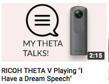
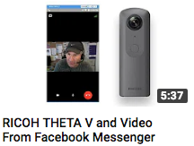

# Fun Tests To Explore THETA V Capability

This section is a work in progress. It's intended to show off some functionality and tests that are a "good start" but maybe need more effort. 

## Sound

The THETA has all the functionality of a normal Android system. This includes using its speakers and mics (4 total) to interact with users. It's clear that the THETA V plug-in technology can be used to provide audio prompts to users, including human voice feedback. "Hey, THETA, take a picture now," for example.

Here's a short, cool test using the internal speaker to play human speech. The audio file is single channel, 22050Hz 32-bit.  

## Apps

Since you've got a full Android OS funning inside the camera, there are quite a bit of apps and utilities that are already available. Here's a simple test after installed Facebook Messenger in a THETA V. We used Facebook Messenger to receive video and audio streams from the Internet. The video also shows the  THETA V playing music and audio from internal plug-ins.

