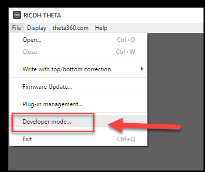

# Requirements for Development

## Required Hardware 
  * The SDK was tested with a RICOH THETA V under the following conditions:
  * Camera
    * Hardware
      - RICOH THETA V
    * Firmware
      - ver.2.30.1 and above
        - Information on checking and updating the firmware is [here](https://theta360.com/en/support/manual/s/content/pc/pc_09.html)
    * The camera must be unlocked in Developer Mode. Join the 
    [RICOH THETA Plug-in Partner Program](https://api.ricoh/products/theta-plugin/) for information
    on unlocking your camera.

## Process to Unlock

Once you sign up for the partner program, you can use the free Ricoh Desktop
application version 3.5 or above to put the camera into Developer Mode using
a USB cable.

  
##  Software for Development

  * Development Environment
      * Windows 10 Version 1709
        - In Windows 7, adb connection does not work with USB
      * macOS High Sierra ver 10.13
  * Development - Build environment
      * Android Studio 3.0+
      * Gradle 3.0.1
      * Android SDK (API Level 25)
      * compileSdkVersion 26
      * buildToolsVersion "26.0.3"
      * minSdkVersion 25
      * targetSdkVersion 25
   
   
## THETA Plugin Technology Components

  * Photography（images/video）    
      * Camera API
      * AudioManager API
      * WebAPI
    
  * Sensors  
      * Gyroscope (3-axis)
      * Accelerometer (3-axis)
      * Magnetometer (3-axis)
    
  * UI Elements
      * Buttons
      * Microphones
      * LEDs
      * Speakers
    
  * USB    
      * Device
      * Host
    
  * Wi-Fi    
      * Direct Mode（Ad hoc Mode）
      * Client Mode（Infrastructure Mode）
    
  * BLE Peripherals    
      * Central
        
  * Application Examples   
      * Image Recognition
      * Image Quality Improvement
      * Zenith Correction
      * Shooting Sequence Control
      * Cloud/Social Media Sharing
      * External Device Connectivity
      * WebUI
      * WebRTC      
      
## Warnings When Developing Plug-ins
This list is taken directly from the How To Develop section of the official RICOH THETA documentation [here](https://api.ricoh/docs/theta-plugin/how-to-develop/#warnings-when-developing-plug-ins). Please see the [Plug-in Submission](http://theta360.guide/plugin-guide/workflow/submit) section for more information.

_Please note "You cannot start a service" in the list below - Running a service as a part of your plug-in is not allowed by RICOH. It’s possible that the service continues to run in the background after the plug-in is stopped. This can end up being a resource issue for the camera. Therefore, implementing something like an “account manager service” will mean your plug-in will be rejected by RICOH._  

  * To install the developed plug-in on RICOH THETA V you need to enable ADB. Please register as a developer with RICOH and enable ADB according to the documentation. (Please be patient as we are planning to release the developer registration mechanism and effective ADB usage techniques in the near future.)
  * Please limit the size of the plug-in to 256MB
  * Plug-in and package names cannot exceed 64 characters and an extension must use apk
  * Version number must follow the [versioning information](https://api.ricoh/docs/theta-plugin/how-to-develop/#version-information)
  * Use of [open source licenses](https://api.ricoh/docs/theta-plugin/how-to-develop/#open-source-licenses) must be explicitly stated
  * You cannot start a service
  * When you press and hold the mode button for 2 seconds or more, the plug-in must terminate
  * When the plug-in is terminated, the plug-in must give a [notification of termination for the plug-in](https://api.ricoh/docs/theta-plugin-reference/broadcast-intent/#notifying-completion-of-plug-in)

