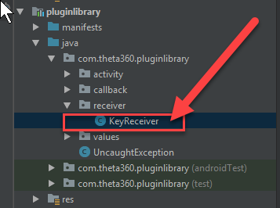
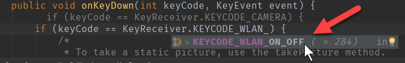

# Camera Buttons Tutorial

In the next example, we'll control the buttons of the camera.

## 1 Inspect pluginlibrary

From inside of Android Studio, go back to pluginlibrary. It is part of the SDK.
Look for the `KeyReceiver` file.

In the KeyReceiver subclass of BroadcastReceiver, you can see that the three usable 
buttons are defined as constants.

    public class KeyReceiver extends BroadcastReceiver {
        public static final int KEYCODE_CAMERA = 27;
        public static final int KEYCODE_MEDIA_RECORD = 130;
        public static final int KEYCODE_WLAN_ON_OFF = 284;

        public static final String ACTION_KEY_DOWN = "com.theta360.plugin.ACTION_KEY_DOWN";
        public static final String ACTION_KEY_UP = "com.theta360.plugin.ACTION_KEY_UP";
        private static final String KEY_CODE = "keyCode";
        private static final String KEY_EVENT = "KeyEvent";

## 2 Locate buttons on camera

There are three buttons you can map:

| Button Common Name | Name in Library | Code | Location |
| ------------------ | ------------------- |:----:| -------- |
| WiFi               | KEYCODE_WLAN_ON_OFF | 284  | side middle |
| Mode               | KEYCODE_MEDIA_RECORD | 130  | side bottom |
| Shutter            | KEYCODE_CAMERA | 27   | front       |

Two of the buttons are on the side of the camera, below the power button. The third
button is on the front of the camera. It is the big *shutter* button.

## 3 Open `MainActivity`

In Android Studio, go back to `MainActivity` and look for the `onKeyDown` method.

In `MainActivity.java`, there is an example of using the `keyCode`.

    protected void onCreate(Bundle savedInstanceState) {
        super.onCreate(savedInstanceState);
        setContentView(R.layout.activity_main);

        // Set a callback when a button operation event is acquired.
        setKeyCallback(new KeyCallback() {
            @Override
            public void onKeyDown(int keyCode, KeyEvent event) {
                if (keyCode == KeyReceiver.KEYCODE_CAMERA) {
                    /*
                     * To take a static picture, use the takePicture method.
                     * You can receive a fileUrl of the static picture in the callback.
                     */
                    new TakePictureTask(mTakePictureTaskCallback).execute();
                }
            }

## 4 Map takePicture to Middle Side Button

As a simple test, we will map the middle side or *wifi* button to take a picture. 
If you forget the constant name, you can use Android Studio code completion to find it.

## 5 Build, install, test

Follow these steps:

1. build the apk from inside of Android Studio
2. install it with adb
3. reboot camera
4. put camera into plug-in mode
5. test it on the camera by pressing the middle button on the side of the camera