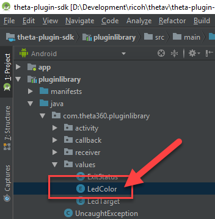
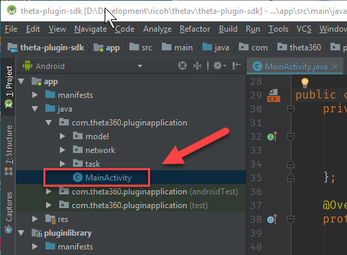

# LED Color Tutorial 

## 1 First steps with pluginlibrary

Open Android Studio. Identify the available colors. In `pluginlibrary`, the LED colors are defined in `LedColor`. Open
the file to inspect the available colors.

    pluginlibrary -> java -> com.theta360pluginlibrary -> values -> LedColor

## 2 Identify LED Colors

You'll only be able to change the color for the WiFi LED on the front of the camera.  Take note of the color
you want to use. This tutorial will use MAGENTA.

    RED("red", 0b001),
    GREEN("green", 0b010),
    BLUE("blue", 0b100),
    CYAN("cyan", 0b110),
    MAGENTA("magenta", 0b101),
    YELLOW("yellow", 0b011),
    WHITE("white", 0b111),;

## 3 Identify Camera LED Targets

The camera has 8 LEDs. You can control LEDs 3 through 8.
This tutorial will focus on LED3, the WiFi LED. You can try different LEDs
on your own. 

## 4 Review LED Example in SDK.

In `MainActivity`, there is an example that blinks the WiFi LED.

    app -> java -> com.theta360.pluginapplication -> MainActivity

Look for this code section.

    public void onKeyUp(int keyCode, KeyEvent event) {
        /**
            * You can control the LED of the camera.
            * It is possible to change the way of lighting, the cycle of blinking, the color of light emission.
            * Light emitting color can be changed only LED3.
            */
        notificationLedBlink(LedTarget.LED3, LedColor.BLUE, 1000);

You can change the target, color, and blink rate. The higher the number, the slower the rate.
The example below will use a delay of 300 between blinks to cause the LED to blink faster.

## 5 Change LED color and blink rate

The example below will flash LED3, the WiFi LED, faster and display
a magenta color.  Edit `MainActivity` as follows.

        notificationLedBlink(LedTarget.LED3, LedColor.MAGENTA, 300);

## 6 Save changes

Select *Save all* from the *File* menu. 

## 7 Build apk 

## 8 Identify location of apk

    theta-plugin-sdk > app > build > outputs > apk > debug > app-debug.apk

## 9 Check installation setup

We will use adb to install the apk into your THETA V. Confirm that you have the following set up:

* Your THETA V should be connected to your computer with a USB cable.
* You must be using an unlocked THETA V that is in *Developer Mode*
* adb needs to be in your PATH

If you are unsure about any of the steps above, refer to the previous sections. You can
also ask questions in the community at [http://plugin.community.theta360.guide](http://plugin.community.theta360.guide).
If you are at a workshop, please raise your hand and someone will assist you.

## 10 cd into apk directory

Change directory into the same directory that your apk is in.

## 11 Use adb to install the apk into your camera

In the directory that your apk is in, run the following command:

    adb install -r app-debug.apk

You should see  *Success*. If your daemon is not running, you will see message that it is starting.

## 12 Reboot camera

Hold the camera power button down for 4 seconds to shutdown the camera. You will see red LEDs flash.
If you do not hold the power button down for 4 seconds, the camera will go into sleep mode. Once the 
camera is shutdown, turn on the camera again by pressing the power button.

## 13 Put camera into plug-in mode

Press the mode button for longer than 2 seconds. LED2 will turn white.

## 14 Verify LED is blinking

After placing the camera into plug-in mode, you should see LED3 blinking with a magenta color.

Congratulations!  You've just successfully built and installed your first custom plug-in. You are now
a plug-in developer!

## 15 Troubleshooting

### Problem: `adb install -r app-debug.apk` hangs

Unplug the USB cable from your computer and try again.

### Problem: Install succeeds, but nothing happens

* Use the RICOH mobile app or the API to verify that plugin application is selected as the active plugin
* Use Vysor to uninstall old plug-in
* Use Vysor to start the plug-in. Click on the plug-in icon in Vysor with the same process you would use to launch
a mobile phone app

