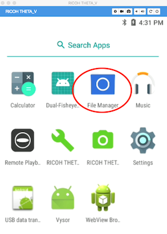
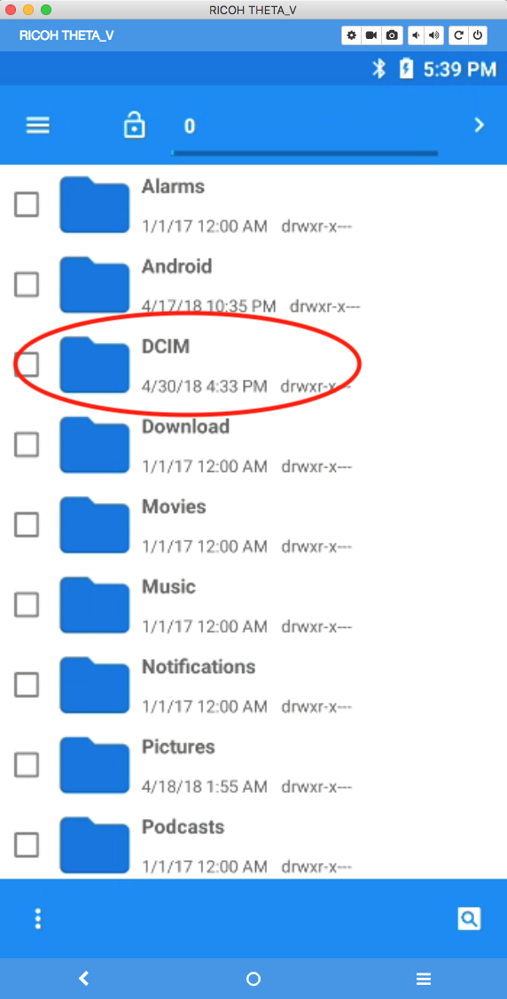
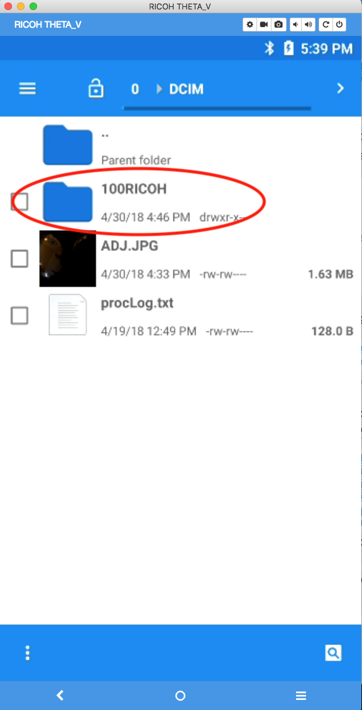
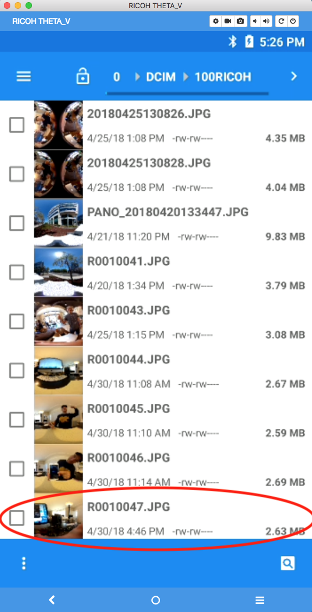

# Vysor Tutorial

Vysor is a great tool to provide quick feedback on how your app is doing. Vysor 
will display a virtual screen from the THETA V to your desktop workstation. Vysor
is useful for the following development processes:

1. verify plug-in was installed
2. set plug-in permissions
3. connect camera to Internet for network testing
4. verify plug-in launches
5. test functionality of third-party Android apps to see if it runs on the THETA V before building your own app
6. quickly view and send pictures directly from the camera to test functionality

## 1 Install Vysor
Go to  [https://www.vysor.io/](https://www.vysor.io/) 
and install Vysor.

## 2 Select RICOH THETA_V as device
After starting Vysor, you will be able to choose your device, *RICOH THETA_V*.  Press *View*.

Vysor will start up.

## 3 Review Installed Apps and Plug-ins

Click on the home button.

Any launcher will work. I'm using the Snapdragon Launcher.

You will see all the apps.

## 4 Review Plug-in Permissions

Go to App Settings

When developing your custom app, you may need to set Permissions for *Storage* and *Camera*.

The Plugin Application in the SDK has the permissions set automatically.

## 5 Use Vysor to Launch Apps for Quick Testing

Click on your plug-in inside of Vysor to launch your app directly in Vysor
for quick testing.

## 6 Use Vysor to Veriify App Launching

With your camera connected to Vysor, push the physical *mode* button on your camera to put the camera into
plug-in mode. When the camera goes into plug-in mode, it will automatically
launch the active plug-in. You can see this visually on Vysor.

## 7 Use Vysor to Verify Plugin Installation

Vysor will show your installed plug-ins as icons. This is a quick
way to verify that your plug-in intalled correctly.

You can install multiple plugins into the THETA V. In the example below,
I'm using Vysor to verify that I installed my new plugin 
*ConstructionPlugin* in addition to the *PluginSample* I installed
earlier.

Prior to selecting with my new *ConstructionPlugin* with the API, I set
the permissions with Vysor. Settings -> Apps -> YourAppName

## 8 Verify Image File Names with Vysor

In order to download the picture with adb, you first need to find out the exact filename. You can use Vysor to find the filename.

Go into File Manager

Down into DCIM

Down into 100RICOH

If you have a lot of images on the camera, you may need to scroll down to the bottom of the list.

There's your filename, the newest image. In this case, it's R0010047.JPG
   
Then use adb pull to download the picture to your local machine   
   
    $ adb pull /sdcard/DCIM/100RICOH/R0010047.JPG
    /sdcard/DCIM/100RICOH/R0010047.JPG: 1 file pulled. 21.2 MB/s (2790527 bytes in 0.126s)

## 9 Use Vysor to Configure WiFi and Test Apps

You can use Vysor to connect your camera to the Internet, similar to connecting a normal
Android phone to the Internet. The only tricky part is to enable the keyboard and back button on Vysor.

### 9.1 Disable the THETA V camera process 

The THETA V camera process interferes with the keyboard and backbutton.
To use the keyboard and back button, you need to stop the camera process.

The video [Getting Vysor Back Button to Work - RICOH THETA Development](https://youtu.be/dMBLHgyGZe4) 
shows the setup process.

The steps are also explained below.

#### 9.1.1 Connect your THETA V to Vysor

#### 9.1.2 Go to settings

Expand apps.

Go into settings.

#### 9.1.3 Go to Developer options

If you don't have *Developer options* visible on your camera, you may need to [enable developer options](https://developer.android.com/studio/debug/dev-options) by going to *About phone* and 
tapping Build number 7 times.

#### 9.1.4 Go to Running services

Access *Running services*.

#### 9.1.5 Select the *RICOH THETA V* process

#### 9.1.6 Locate the *CameraService*

#### 9.1.7 Stop the service
Be bold.

#### 9.1.8 Test the keyboard

#### 9.1.9 Test the back button

