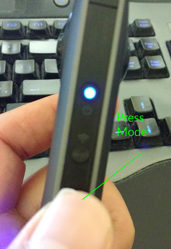
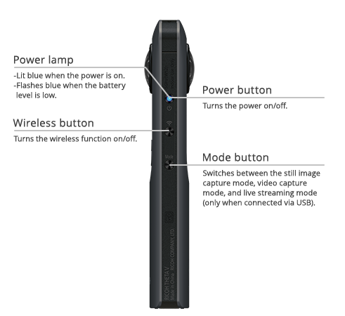
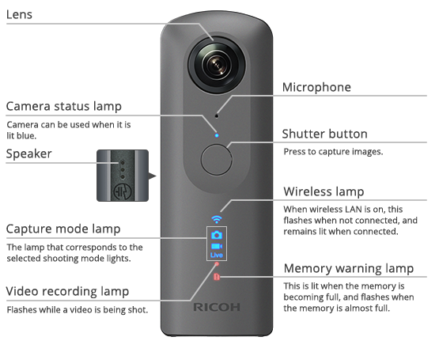
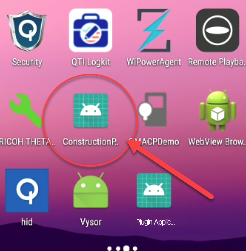
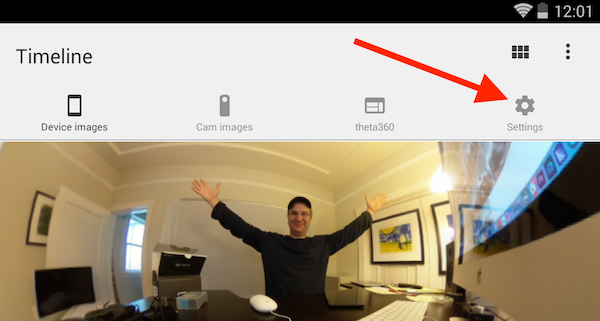
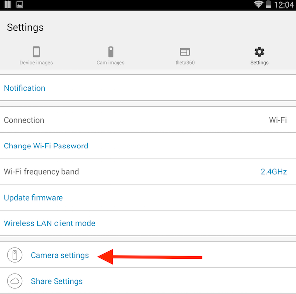
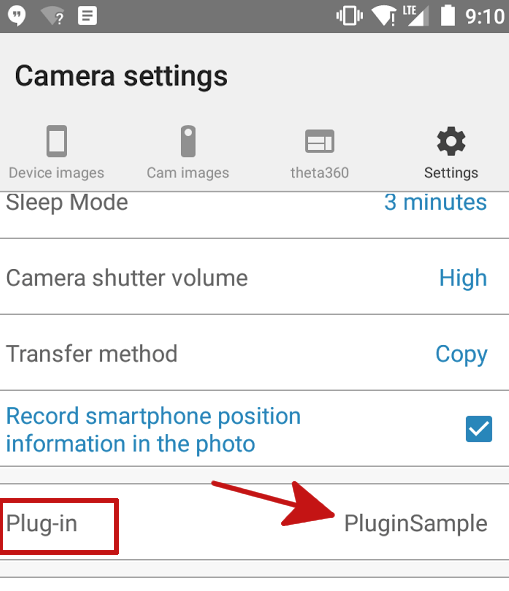
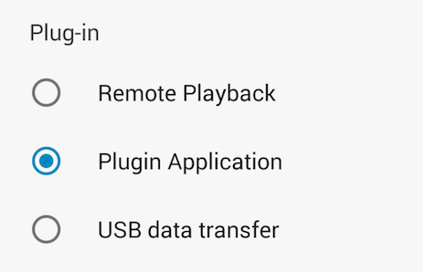
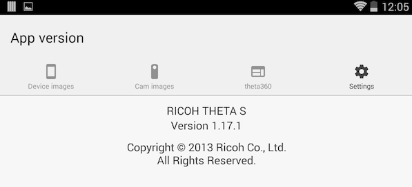

# Plugin Use

In the future, your plugin can be used by all THETA camera owners. They will
be able to install the plugin with a computer application that Ricoh
will provide.

End-users can choose your plugin with the official RICOH THETA mobile app or a custom application that you provide.  For development, you can also select the
active plug-in with the WiFi API. 

## Testing the Sample Plugin

Disconnect the camera from the USB cable. Press the physical button on the camera. There will be no sound,
but the image will be captured. The plug-in will save the image to a file called `/sdcard/DCIM/plugin.jpg`.

### Download the Picture

    $ adb pull /sdcard/DCIM/plugin.jpg
    /sdcard/DCIM/plugin.jpg: 1 file pulled. 21.2 MB/s (2790527 bytes in 0.126s)

You can also check the file in Vysor.

## Put Camera into Plugin Mode
Plugin mode can only be enabled on
the RICOH THETA V.

Plugins will not work on the THETA S (older model), THETA SC or THETA m15. 

Every THETA V can be put into plugin mode by first turning the THETA V
on and then pressing the mode button. 

After pressing the mode button for 2 seconds, release it.

The *Camera status lamp* will turn solid white.

Additional information on the side buttons is shown below.

Information on the front of the camera is shown below.

## Use Vysor to Verify Plugin Installation

You can install multiple plugins into the THETA V. In the example below,
I'm using Vysor to verify that I installed my new plugin 
*ConstructionPlugin* in addition to the *PluginSample* I installed
earlier.

Prior to selecting with my new *ConstructionPlugin* with the API, I set
the permissions with Vysor. Settings -> Apps -> YourAppName

## Set Active Plugin

When you develop the plugin application, a companion mobile application can set the active plugin using the
WiFi API of the camera. The Ricoh mobile application that
most of your users will also have can set the active plugin. For
testing, you can either use the Ricoh mobile app, build your own mobile app, or send a REST command
using an HTTP testing tool such as 
[curl](https://curl.haxx.se/)  or [Postman](https://www.getpostman.com/). In the example below, I am using 
Restlet Client, which is a browser-based Chrome tool similar to Postman.

I am using THETA V firmware 1.20.1. This command may change in the future.  Use com.theta360.yourappname for the packageName. Note that in the example below, my package is called pluginsample.

This is the POST command:

    http://192.168.1.1/osc/commands/execute

    {
        "name": "camera._setPlugin",
        "parameters": {
            "packageName": "com.theta360.pluginsample",
            "boot": "true",
            "force": "false"
        }
    }

Note that the command changed in firmware 1.20.1. The command 
was previously `camera._setApplication` and is deprecated, though it 
still works in firmware 1.20.1.

## Verify Active Plugin with Mobile App

Using the Ricoh mobile app, you can see and select the
active plugin. 

Connect your RICOH THETA mobile app to your THETA V.

Go to Settings.

On the *Settings* screen of your mobile app, click on
*Camera settings*.

On your *Camera settings* screen you will be able to see your
Plug-in. On the screen at the top of this section, my plug-in is called
*PluginSample*.

Click on the active plug-in name to display a choice
of available plug-ins.

This process is current as of version 1.17.1 of the Android application.

### Show List of Plugins With API

The POST command:

    $ curl -X POST 192.168.1.1/osc/commands/execute --data '{"name":"camera._listPlugins"}' -H 'content-type: application/json'

The response

    {
    "name":"camera._listPlugins",
    "results":{
        "plugins":[
            {
                "applicationName":"Remote Playback",
                "boot":false,
                "bootOptions":"",
                "force":false,
                "foreground":false,
                "packageName":"com.theta.remoteplayback",
                "running":false,
                "type":"extended",
                "version":"1.00.20171106144412"
            },
            {
                "applicationName":"PluginSample",
                "boot":true,
                "force":false,
                "foreground":false,
                "packageName":"com.theta360.pluginsample",
                "running":false,
                "type":"extended",
                "version":"1.0"
            }
        ]
    },
    "state":"done"
    }

> __Note that this command was changed from `camera._listApplications`, which is now deprecated__