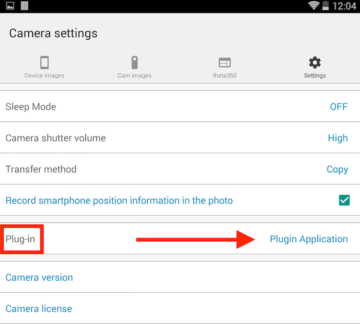

# Plugin Use

This section will walk you through using Android Debub Bridge (adb) to install a plugin into the camera. You will put the camera into Plugin Mode and test the SDK sample Plugin. You will set the active Plugin using the RICOH THETA mobile app, and you will show a list of all the Plugins installing in the camera using the API.

## 1 Use adb to Connect

Connect the THETA V to your developer workstation with a USB cable.

On Windows, `adb` is installed into 

    C:\Users\[user]\AppData\Local\Android\sdk\platform-tools
    
On the Mac, `adb` is installed into

    /Users/[user]/Library/Android/sdk/platform-tools

### 1.1 Add adb to your PATH

You should add `adb` into your PATH.  On Windows, you can edit the PATH with *Control Panel -> System and Security -> System -> Advanced system settings -> Environment Variables -> Path*

### 1.2 Use adb to confirm connection

After putting `adb` into your PATH, start a new cmd shell and run 

    adb devices -l

If you don't use `-l`, you can still identify the device by the serial number
of your THETA V. In the example below, my THETA V has a serial number of 00101082.

    $ adb devices
    List of devices attached
    * daemon not running. starting it now at tcp:5037 *
    * daemon started successfully *
    00101082	device

### 1.3 Use adb to explore file system

Log into the camera using `adb shell`

Do an `ls` to list all files. The directory structure and overall environment is the same as a standard Android phone.

    $ adb shell
    msm8953_64:/ $ ls -l                                                                                                                                                 
    total 4240
    drwxrwxr-x   5 media_rw media_rw    4096 2017-01-01 00:00 DCIM
    dr-xr-xr-x  17 root     root           0 1970-04-02 10:08 acct
    drwxr-xr-x   2 root     root          40 1970-01-01 00:00 bt_firmware                             
    lrwxrwxrwx   1 root     root          50 1970-01-01 00:00 bugreports -> /data/user_de/0/com.android.shell/files/bugreports
    drwxrwx---   6 system   cache       4096 2017-11-14 15:55 cache
    lrwxrwxrwx   1 root     root          13 1970-01-01 00:00 charger -> /sbin/healthd
    drwxr-xr-x   2 root     root           0 1970-04-02 10:08 config
    lrwxrwxrwx   1 root     root          17 1970-01-01 00:00 d -> /sys/kernel/debug
    drwxrwx--x  43 system   system      4096 2017-09-21 14:00 data
    -rw-r--r--   1 root     root         966 1970-01-01 00:00 default.prop
    drwxr-xr-x  15 root     root        3180 2017-11-27 12:50 dev
    drwxr-xr-x   3 root     root        4096 1970-01-01 00:00 dsp

Change directory into DCIM/0 

The RICOH THETA Plug-in SDK uses the
[android.hardware.Camera](https://developer.android.com/reference/android/hardware/Camera.html) class. It saves images into the normal location you would expect from an Android device. You can also use the [RICOH THETA API v2.1](https://developers.theta360.com/en/docs/v2.1/api_reference/), which is is a WebAPI based on OSC to take pictures from your plug-in by sending a POST command to the internal camera web server.

    127|msm8953_64:/DCIM/0 $ ls -l
    total 128
    drwxrwxr-x 2 media_rw media_rw  4096 2017-01-01 00:00 Alarms
    drwxrwxr-x 2 media_rw media_rw  4096 2017-09-22 22:31 Converted
    drwxrwxr-x 3 media_rw media_rw  4096 2017-09-19 18:15 DCIM
    drwxrwxr-x 2 media_rw media_rw  4096 2017-01-01 00:00 Download
    drwxrwxr-x 2 media_rw media_rw  4096 2017-01-01 00:00 Movies
    drwxrwxr-x 2 media_rw media_rw  4096 2017-10-02 15:31 MtpOperation
    drwxrwxr-x 2 media_rw media_rw  4096 2017-01-01 00:00 Music
    drwxrwxr-x 2 media_rw media_rw  4096 2017-01-01 00:00 Notifications
    drwxrwxr-x 2 media_rw media_rw  4096 2017-01-01 00:00 Pictures
    drwxrwxr-x 2 media_rw media_rw  4096 2017-01-01 00:00 Podcasts
    drwxrwxr-x 2 media_rw media_rw  4096 2017-01-01 00:00 Ringtones
    -rw-rw-r-- 1 media_rw media_rw 15972 2017-09-25 23:35 btsnoop_hci.log
    drwxrwxr-x 2 media_rw media_rw  4096 2017-09-21 14:26 ptp

Locate Pictures and Movies. These are standard Android directories. The THETA V stores images in /DCIM/0/DCIM/100RICOH

    msm8953_64:/DCIM/0/DCIM/100RICOH $

    msm8953_64:/DCIM/0/DCIM/100RICOH $ ls -l                                                                                                             
    total 554752
    -rw-rw-r-- 1 media_rw media_rw   1970120 2017-09-28 12:58 R0010025.JPG
    -rw-rw-r-- 1 media_rw media_rw   2402374 2017-09-28 12:58 R0010026.JPG
    -rw-rw-r-- 1 media_rw media_rw   2136165 2017-09-28 12:58 R0010027.JPG
    -rw-rw-r-- 1 media_rw media_rw   2810985 2017-09-28 12:59 R0010028.JPG
    -rw-rw-r-- 1 media_rw media_rw   1834346 2017-10-18 18:34 R0010035.JPG
    -rw-rw-r-- 1 media_rw media_rw    679681 2017-10-21 12:13 R0010036.JPG
    -rw-rw-r-- 1 media_rw media_rw   2103925 2017-10-21 14:16 R0010037.JPG
    -rw-rw-r-- 1 media_rw media_rw  52108839 2017-10-21 14:19 R0010038.MP4
    -rw-rw-r-- 1 media_rw media_rw 108450224 2017-10-21 14:20 R0010039.MP4

## 2 Install Plugin into Camera

Call `adb install -r ./theta-plugin-sdk-master/app/build/outputs/apk/debug/app-debug.apk`

    $ adb install -r ./theta-plugin-sdk-master/app/build/outputs/apk/debug/app-debug.apk 
    * daemon not running. starting it now at tcp:5037 *
    * daemon started successfully *
    Success

## 3 Put Camera into Plugin Mode
Plugin mode can only be enabled on the RICOH THETA V.

Plugins will not work on older THETA models m15, S, or SC. 

Every THETA V can be put into plugin mode by first turning the THETA V
on and then pressing the mode button. 

After pressing the mode button for 2 seconds, release it.

The *Camera Status lamp* will turn solid white.

Additional information on the side buttons is shown below.

Information on the front of the camera is shown below.

## 4 Test SDK Sample Plugin

Press the physical button on the camera. There will be a shutter sound. An image will be captured. 

The picture will be given a filename that is in numerical sequential order incrementing up from the previous picture. The format will be similar to this example filename: R0010047.JPG. 

The plug-in will save the image to a file with the location
and format similar to the example below.

 `/sdcard/DCIM/100RICOH/R0010047.JPG`
 
### 4.1 Get the picture off the camera

Get the file name by using `adb shell`.

Use `adb pull` to get the image file file to your local computer.

Example:

    adb pull /sdcard/DCIM/100RICOH/R0010047.JPG

### 4.2 Alternate techniques to get the file and filename

* Open the THETA in File Explorer as you would with a normal Android phone. Uses MTP.
* Use a tool like Vysor to display a virtual THETA V screen to your workstation. To set up and use Vysor, refer to the section in this community guide on Vysor.

Example of opening camera images up in File Explorer.

Select RICOH THETA V.

If you use the default storage location, the images will be in:

*Fixed storage > DCIM > 100RICOH*

Double-click on the image to open an equirectangular view in Photos.

To test 360 navigation, drag and drop the image onto a 
temporary folder on your computer. Then, drag and drop the local
file onto the RICOH THETA desktop application.

## 5 Set Active Plugin with Mobile App

Using the Ricoh mobile app, you can see and select the active plugin. 

Connect your RICOH THETA mobile app to your THETA V.

Go to Settings.

On the *Settings* screen of your mobile app, click on *Camera settings*.

On your *Camera settings* screen you will be able to see your
Plug-in. On the screen at the top of this section, my plug-in is called
*Plugin Application*.

Click on the active plug-in name to display a choice of available plug-ins.

This process is current as of version 1.17.1 of the Android application.

This concludes the Plugin Use section. Congratulations!

