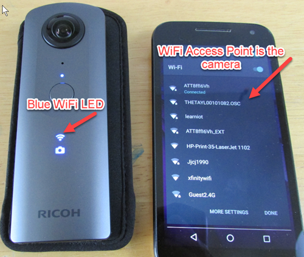
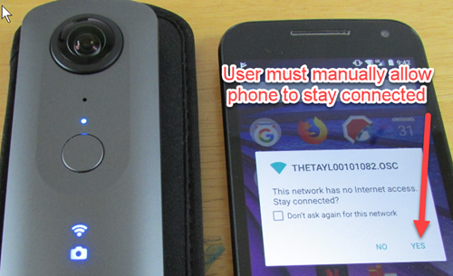
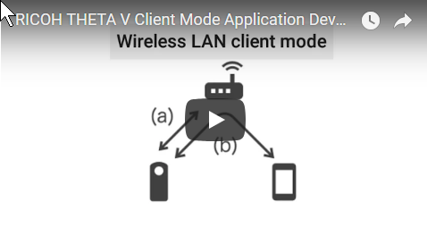
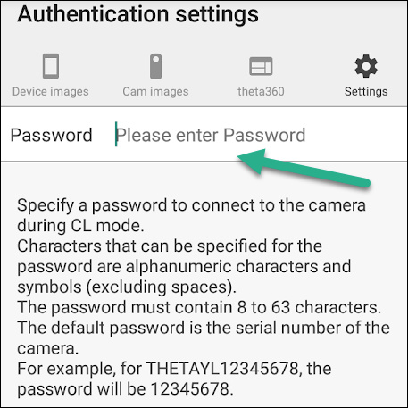
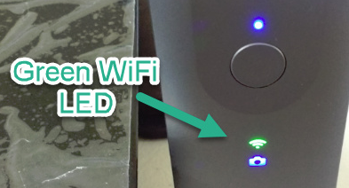
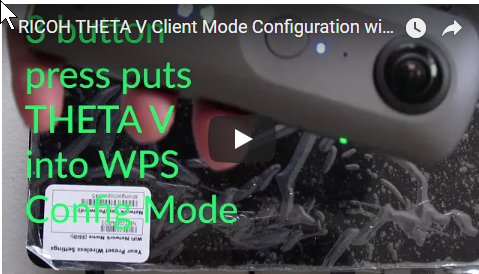
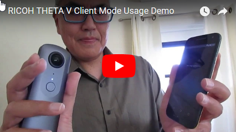

# THETA WiFi API

In addition to the Android Camera class, your plug-in can also use the 
[RICOH THETA API v2.1](https://developers.theta360.com/en/docs/v2.1/api_reference/) web API. 
Some developers find that using the WiFi API is easier. It is based on simple POST and GET HTTP commands.

There are two ways to access the WiFi API:

1. Your plug-in can use the WiFi API from inside of the camera
2. A companion mobile or desktop app can use the WiFi API

## Plug-in Access to WiFi API

Send POST commands 
to the camera's Web API at (http://localhost:8080/). When using the Web API from the plug-in, digest authentication is not required regardless of the wireless LAN mode. For detailed specifications of the Web API, please refer to [API Reference - v2.1 - API & SDK \| RICOH THETA Developers](https://developers.theta360.com/en/docs/v2.1/api_reference/)

The Web API can not be used when the plug-in controls the camera device using the Camera API.

## Companion App Access to WiFi API

**NOTE: Community has not verified these steps. Please
verify and if possible submit an example.**

Steps:

1. Finish plug-in to return control to camera
1. Plug-in releases camera resources
1. Establish a network connection between mobile phone and camera
1. Send HTTP POST or GET command

### Finish Plug-in
Use `com.theta360.plugin.ACTION_FINISH_PLUGIN` with Broadcast Intent to finish the plug-in.
A notification of the completion of the plug-in will be sent. When using Broadcast Intent, the following extension data must be set:

| Key | Type | Description |
| --------------- | ---------------- | ------------------ |
| `packageName` | String  | Package Name |
| `exitStatus` | String | "success" or "failure". Default is "success". |
| `message`   | String | Optional. Default is an empty string. |

With packageName, specify the package name of the plugin itself. With exitStatus, specify “success” when the plug-in ends normally, and “failure” when it ends abnormally. Setting “exitStatus” to “failure” will cause the warning sound to be played and LED2 to blink red.

### Release camera resources

When using “com.theta360.plugin.ACTION_MAIN_CAMERA_CLOSE” with Broadcast Intent, the fact that the plug-in is controlling camera resources will be reported to the camera, and the Camera API will be able to be used.

When using “com.theta360.plugin.ACTION_MAIN_CAMERA_OPEN” with Broadcast Intent, the fact that the plug-in has released camera resources will be reported to the camera, and the Camera API will not be able to be used.

### Network Connection To Camera

In order to connect your companion mobile application to the camera, 
you will need to establish a WiFi connection connection between the camera and the mobile phone.

You can either use Access Point (AP) Mode or Client (CL) Mode. 

**NOTE: Community has not verified that both AP and CL modes work for WiFi API access to the plug-in. Please
verify and if possible submit an example.**

Information on controlling the WLAN is included in the 
[broadcast intent section](https://api.ricoh/docs/theta-plugin-reference/broadcast-intent/) of the 
official Ricoh documentation.

| Operation Mode | Intent            |
| -------------- | ----------------- |
| OFF            | `com.theta360plugin.ACTION_WLAN_OFF` |
| AP Mode        | `com.theta360plugin.ACTION_WLAN_AP` |
| CL Mode        | `com.theta360plugin.ACTION_WLAN_CL` |

#### AP Mode

In AP Mode, the user must first connect their mobile phone to the camera
by using the camera as SSID or *WiFi router* that they connect to. In this
mode, the user will not have Internet access.

On some Android devices, the user must also manually allow the phone to
stay connected to the camera.

#### Client Mode

In CL Mode, the camera connects to the same WiFi router that people use to connect to the Internet.
For example, the camera can connect to the user's office or home router.  The user connects their
mobile phone to the same router.

More information on developing Client Mode Applications is available in the video below.

To ensure security, the commands between the companion app and the camera uses Digest Authentication.

The official Ricoh Mobile app can be used to set up the password for Digest Authentication.

In this mode, the camera WiFi LED will be green.

Your users can configure the camera to connect to their router with WPS. The video below explains the 
process of client mode configuration with WPS.

### POST and GET commands

Comprehensive HTTP API document is available at
[https://developers.theta360.com/en/docs/v2.1/api_reference/](https://developers.theta360.com/en/docs/v2.1/api_reference/).

If you have questions about the WiFi (Open Spherical Camera) API, please post them
in the [THETA API Usage category](https://community.theta360.guide/c/theta-api-usage) 
of the community.