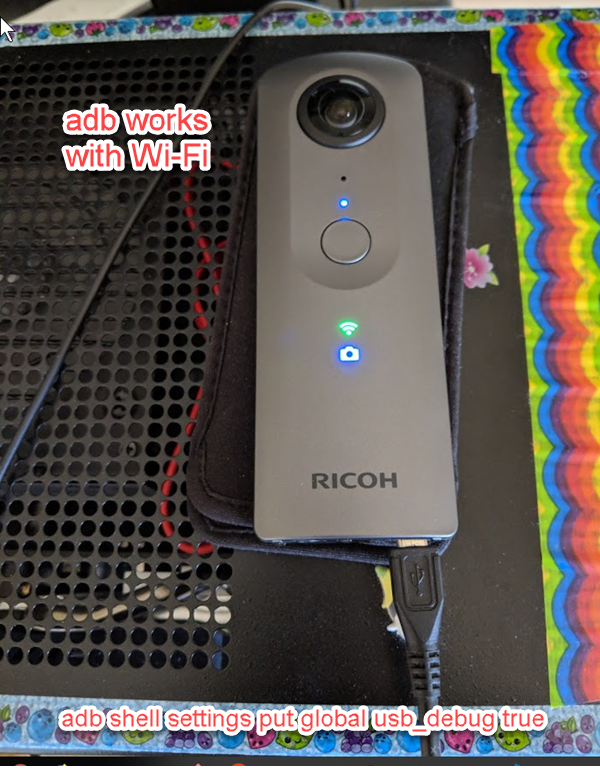
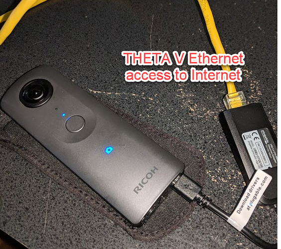
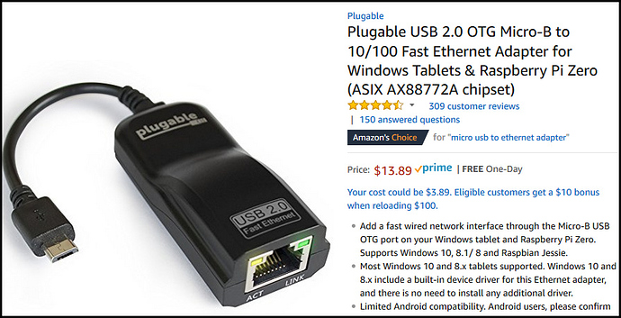
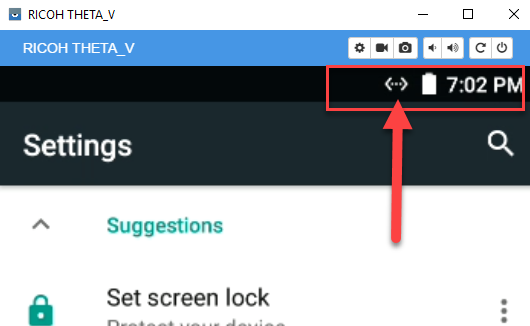

# Development Workflow Tips

## Debugging

### Save logcat to file on camera

This is a typical debugging workflow:

1. Enter `adb shell` in terminal to enter the shell in the camera.
2. `logcat > /sdcard/DCIM/log.txt&`
3. Reproduce issue, camera may reboot.
4. `adb pull /sdcard/DCIM/log.txt` in terminal 

### View logcat on workstation

For some messages, you can also debug the THETA V with a USB 
cable and adb in real-time. The camera will 
operate in Plugin Mode while connected to adb. It's better to
save to save as explained above because the camera may lock or 
reboot when it encounters the bug and you'll lose the connection.

You will be able to get debug messages similar to the example below:

       12-14 07:53:24.105  1171  1373 E TaskPersister: File error accessing recents directory (directory doesn't exist?).

Example debug output with the camera connected to my Linux computer with a USB cable 
and in plug-in mode.

### Enable Wi-Fi when using adb

THETA is set so that Wi-Fi is unavailable while connected to USB. But this will make development more difficult for network connected plug-ins. However, in development mode, Wi-Fi becomes available while connected to USB using the command below.

    adb shell settings put global usb_debug true

### Use adb from an IP address

To get Vysor or adb to work with TCP/IP, you need to run the following command first with the camera connected with a USB cable:

    adb tcpip 5555

I got the IP address from my router.

Once connected, I was able to establish adb connection with:

    adb connect IP.address:PORT

or with my IP address of 192.168.2.102
  
    adb connect 192.168.2.102:5555

You can also use Vysor with an IP address that is established using Wi-Fi or Ethernet.

## Set Active Plugin

When you develop the plugin application, a companion mobile application can set the active plugin using the
WiFi API of the camera. The Ricoh mobile application that
most of your users will also have can set the active plugin. For
testing, you can either use the Ricoh mobile app, build your own mobile app, or send a REST command
using an HTTP testing tool such as 
[curl](https://curl.haxx.se/)  or [Postman](https://www.getpostman.com/). 

### Show List of Plugins With API

The POST command:

    $ curl -X POST 192.168.1.1/osc/commands/execute --data '{"name":"camera._listPlugins"}' -H 'content-type: application/json'

The response

    {
    "name":"camera._listPlugins",
    "results":{
        "plugins":[
            {
                "applicationName":"Remote Playback",
                "boot":false,
                "bootOptions":"",
                "force":false,
                "foreground":false,
                "packageName":"com.theta.remoteplayback",
                "running":false,
                "type":"extended",
                "version":"1.00.20171106144412"
            },
            {
                "applicationName":"PluginSample",
                "boot":true,
                "force":false,
                "foreground":false,
                "packageName":"com.theta360.pluginsample",
                "running":false,
                "type":"extended",
                "version":"1.0"
            }
        ]
    },
    "state":"done"
    }

> __Note that this command was changed from `camera._listApplications`, which is now deprecated__

In the example below, I am using 
Restlet Client, which is a browser-based Chrome tool similar to Postman.

I am using THETA V firmware 1.20.1. This command may change in the future.  Use com.theta360.yourappname for the packageName. Note that in the example below, my package is called pluginsample.

This is the POST command:

    http://192.168.1.1/osc/commands/execute

    {
        "name": "camera._setPlugin",
        "parameters": {
            "packageName": "com.theta360.pluginsample",
            "boot": "true",
            "force": "false"
        }
    }

Note that the command changed in firmware 1.20.1. The command 
was previously `camera._setApplication` and is deprecated, though it 
still works in firmware 1.20.1.

### Save HTTP Test Scripts in Separate Tool 

Although you can use a curl script to switch plugins with the WiFi API,
I find it easier to use a tool like 
Restlet Client to save my HTTP test scripts into a group. I can select an
individual test and run it with a push of a button. To switch plugins, I 
saved a script for  `camera._setPlugin`. You can get a list of plugins with 
`camera._listPlugins`.

In addition to saving the HTTP test scripts, Restlet Client or Postman will show the
JSON response in *pretty* format automatically. With curl, you will need to
pipe the output to another tool to get *pretty print*.

## Testing Standard Android Packages

You can download apks from many sites for testing things like 
communication protocol with Facebook Messenger or video transmission.

I've been using this site with good results.

[https://apkpure.com/app](https://apkpure.com/app)

For example, I can send 360 images directly from the THETA V storage to Facebook Messenger.
The images are viewable in 360 by the recipient.

## Enabling Network for All Apps

The Android OS handles both Wi-Fi and Ethernet access. Once the OS has
established network connection, all apps can access the Internet.

### Ethernet

You can use use an Ethernet USB OTG adapter.  

Not all adapters work.
I am using a Plugable USB 2.0 OTG with ASIX AX88772A chipset. 
It is now $13.89 with free shipping http://a.co/7MCF1J5

Worked immediately. Did not require any drivers or any other software. MAC address is written on adapter. Use your router to match up the MAC address with the IP, then assign a static IP to the camera from the DHCP server on your router.

#### Important Note about Powering Camera

Please note that the camera cannot be powered by Ethernet when it is in OTG mode. This means that you must use the camera’s internal battery during the time you are using Ethernet with USB OTG. This may limit the efficacy of this solution depending on your application.

### Wi-Fi

With the keyboard enabled, you can now type in your password for your WiFi hotspot to connect to the Internet.

Connect to WiFi and all your apps and plug-ins will be able to connect to the Internet.

